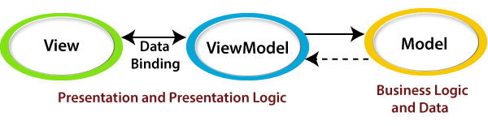
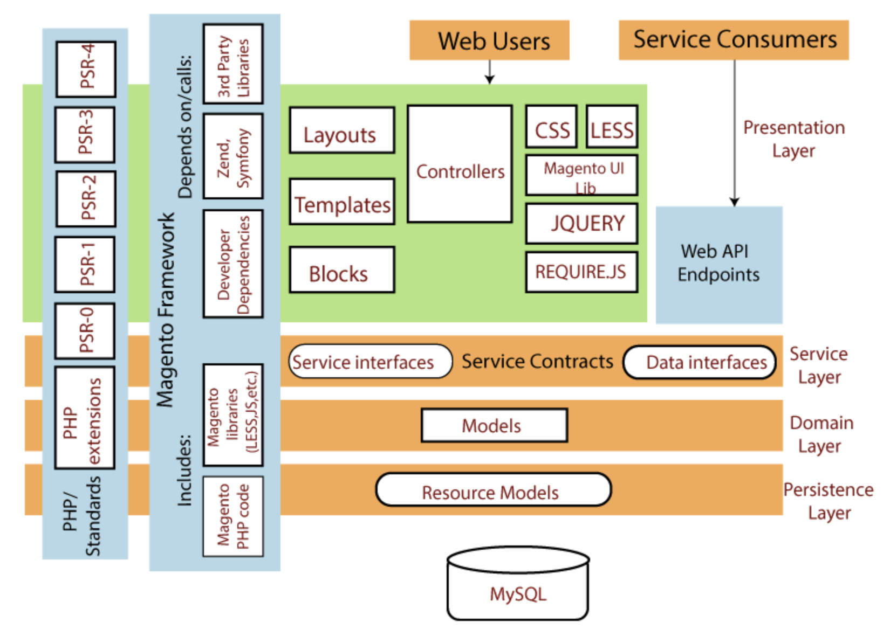
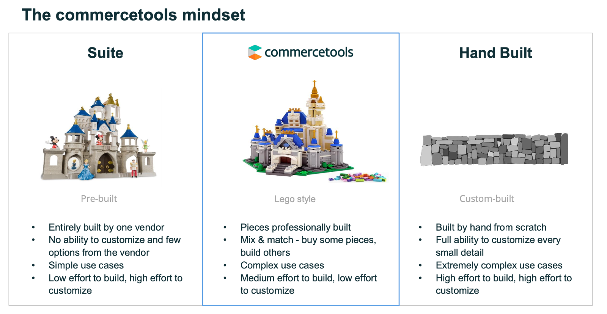

# 1.1. Introduction

## What's this module about?

This module is aimed at training participants in the process of installing and configuring essential components of electronic commerce on the Magento platform. It covers aspects such as installing Docker for container management, configuring Magento to create an online store, and familiarizing users with its user interface and admin panel. Special attention is given to configuring the storefront, which displays the frontend of the store and is crucial for ensuring a convenient and attractive user experience. This module helps participants master the necessary skills for deploying and managing an online store on Magento, focusing on the main project objectives and minimizing distractions on frontend development details. It is also important to note that this module serves as preparation for upcoming modules, where participants will delve into deeper aspects of Magento platform development and management.

So participants gain a fundamental understanding of e-commerce processes through practical tasks in Magento.
Explore the architecture of Magento and recognize its potential as a bottleneck in certain scenarios.
Understand the evolution of e-commerce architecture, including the challenges and advancements that have shaped the industry over time.

## Related Theory

### Magento - as a “Traditional” E-commerce solution

Many clients approach the company seeking digital transformation, and some of them have been relying on "Traditional" systems like Magento. The term "Traditional" here refers to solutions that were chosen for their speed and suitability when the clients' businesses were smaller, rather than being the best-practice approach.

However, as businesses evolve and grow, systems like Shopify, Magento, and WordPress may become bottlenecks, requiring migration to more advanced solutions. The trail aims to familiarize users with the traditional approach to building e-commerce applications, providing insights into these existing systems and their limitations. It serves as a valuable resource to understand the challenges and opportunities associated with digital transformation.

### Glossary

- PIM	- stands for Product Information Management. It's a system or software used by businesses to manage and centralize product information, including technical specifications, marketing descriptions, pricing, and other relevant data. PIM systems help organizations maintain accurate and consistent product data across various channels, such as e-commerce websites, mobile apps, and printed catalogs. This centralized management ensures that product information is up-to-date and synchronized across all sales and marketing platforms, improving efficiency and data quality.
- DAM - stands for Digital Asset Management. It's a system or software used by organizations to store, organize, manage, and retrieve digital assets efficiently. Digital assets can include a wide range of media files, such as images, videos, audio files, documents, and more. DAM systems provide tools for cataloging, tagging, searching, and sharing digital assets within an organization.
- Cross-sell - a sales and marketing technique used in e-commerce and various retail settings to encourage customers to purchase additional or related products alongside the ones they are already interested in or have added to their shopping cart. The primary goal of cross-selling is to increase the average transaction value by offering complementary or higher-value items to customers.
- Upselling - a sales and marketing technique commonly used in e-commerce and various retail settings to encourage customers to purchase a more expensive or premium version of the product they are interested in or have added to their shopping cart. The primary goal of upselling is to increase the average transaction value by persuading customers to spend more by upgrading to a higher-end product or adding premium features.
- Cart merge - in e-commerce refers to the process of combining or merging multiple shopping carts or baskets into a single cart. This functionality is especially useful in scenarios where customers have interacted with an e-commerce website or app using different devices or sessions and have added items to their carts in each of those interactions.
- "PDP" - stands for "Product Detail Page." The Product Detail Page is a crucial element of an online store's website or app, and it serves as a dedicated page that provides comprehensive information about a specific product or item available for purchase. The primary purpose of a PDP is to give potential customers detailed insights into a product, helping them make informed purchasing decisions.
- PLP - stands for "Product Listing Page." The Product Listing Page is a fundamental component of an online store's website or app, and it serves as the primary page where customers can browse and explore a selection of products offered by the retailer. PLPs are often the first pages that customers interact with when they visit an online store.
- SRP - stands for "Search Results Page." It's the page that displays search query results to users when they search for products on an online store's website or app. This page typically includes a list of products that match the user's search terms, allowing them to browse and explore relevant items.

### The architecture of Magento and why this can be a bottleneck

Magento 2 has a Model View ViewModel (MVVM) architecture. This MVVM architecture provides a much more robust separation between the Model and View layer, as it is closely related to the Model View Controller (MVC). A brief description of MVVC is given below: 

Magento 2 is split into four layers, according to the official documentation. 

- Presentation Layer
- Service Layer
- Domain Layer
- Persistence Layer 

 Why is it becoming a bottleneck: 

- Outdated PHP stack – it is hard to find a team, the team often wants to use new technologies. 
- Monolith Architecture with its own pros and cons, such as hard to move into the cloud, hard to maintain, often it is slow time to market, it is not possible to split work between different teams without strong coordination.
- Platform-Centric approach
- Can’t go with the API-first approach. 

### E-commerce Architecture evolution

Useful reading: [Pavel Weller: Digital Transformation Will Inevitably Lead You to a MACH Architecture. Start Now.](https://www.epam.com/insights/blogs/digital-transformation-will-inevitably-lead-you-to-a-mach-architecture-start-now)

A traditional architecture provides all the components needed for managing and publishing content on the web with a single codebase. Fifteen years ago, it was the only and the most convenient option for eCommerce businesses. The challenges have just started to appear. Traditional, all-in-one solutions were designed to give full control of the system but, as it turns out, control must go hand-in-hand with flexibility. Without the latter, the systems are simply incapable of keeping up with the pace of business changes.  

## Prerequisites

We don't need something specific to this module just next:

- curl installed.
- npm installed.
- access to storefront repository: https://github.com/EPAM-JS-Competency-center/camp-storefront-nuxt .
- create a repository for your project and give shared access to mentors.
- understand program context.