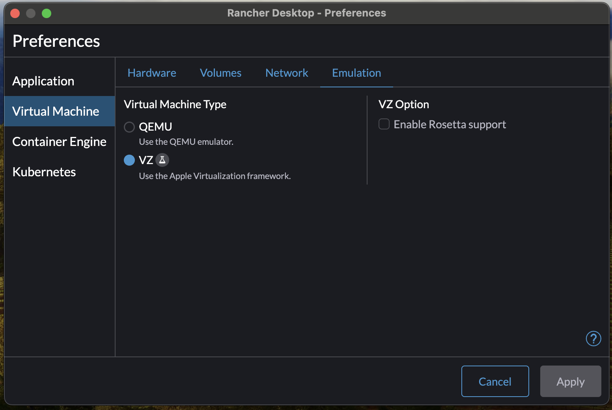
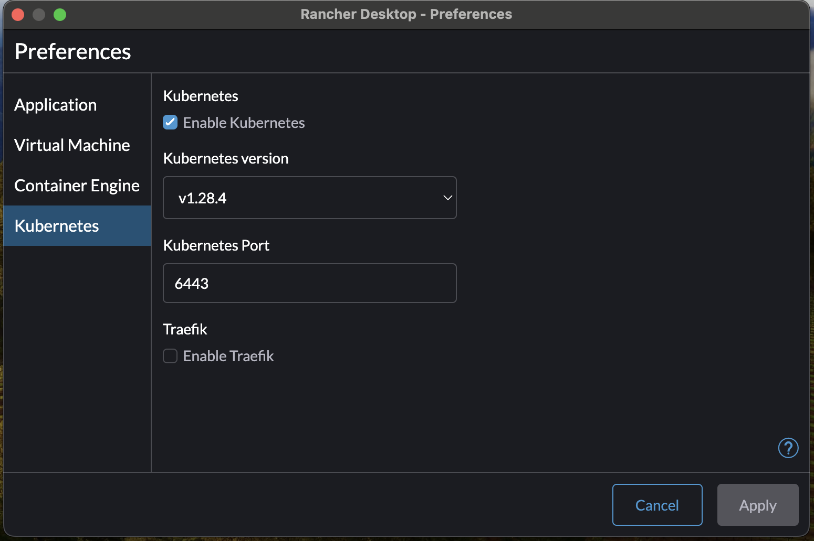

# 1.4. Practical Task - Settup docker

## What is this task about

We intended to utilize Docker for our Magento application to simplify the installation process and avoid configuring various related dependencies separately. However, we've encountered an issue: Docker Desktop is no longer available for free, which impedes our ability to use it as we did previously.

## NOTICE

If you have Docker Desktop configured, approved, and available for use (or if there's an alternative solution in place), you can skip this task.

## What should be done

- The docker must be successfully configured and launched.

## Task

We recommend using [rancher](https://rancherdesktop.io/)

Please proceed with installing and configuring it. Below, we have provided examples of configuration:

