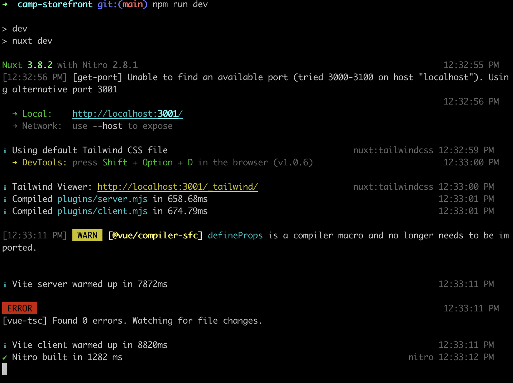
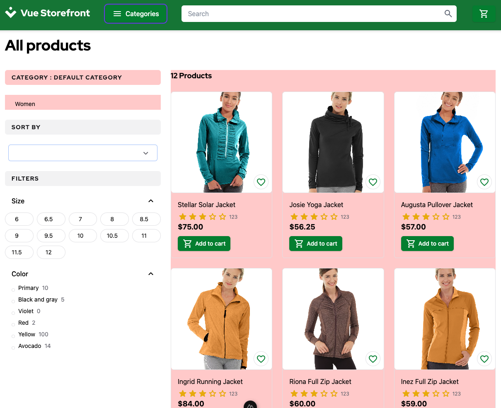

# 1.. Practical Task - Configure storeFront application

## What is this task about

This task focuses on setting up and launching the storefront. We'll utilize it as a solution for the UI component, allowing us to concentrate on course objectives without distractions from the front-end development aspect.

:::info
The idea of the StoreFront UI is to provide the course members with a ready to go UI for the integration. The UI itself doesn't require any actions from a student, as you implement required enpoint in your API, the StoreFront will try to use it, otherwise it will fall back to a mocked data.
The sections below describe how to setup and verify the StoreFront UI.
:::


## What should be done

- The storefront must be successfully configured and launched.
- Upon accessing the storefront, all frontend components, including navigation, product displays, and interactive elements, should be fully operational and functional.
- Users should be able to navigate through the storefront, view products, and interact with UI elements without encountering any errors or disruptions.


## Task

### Clone repository
```bash
# git
git clone git@git.epam.com:EPAM-JS-Competency-center/camp-storefront-nuxt.git
```

### Setup

Make sure to install the dependencies:

```bash
# npm
npm install

# pnpm
pnpm install

# yarn
yarn install

# bun
bun install
```

### Running Development Server

Start the development server on `http://localhost:3000`:

```bash
# npm
npm run dev

# pnpm
pnpm run dev

# yarn
yarn dev

# bun
bun run dev
```

### Verify and Exlore the StoreFront

The picture below shows how the output should look if the application successfully started. Don't get scared by the `ERROR` label in the console.


After the application is started it's ready to use. You can play with it to understand what capabilities are available.

If you open the `/category` page, you should see a list of products in the `main` section of the page, and there is a navigation section in the sidebar. The sections with `red` background are components that require endpoints from the scope of this programm. For the example below there are two endpoints required:
- List of categories
- List of products in the category



There are more pages and actions: 
- Product details page with Add To Cart action
- Shopping Cart
- Checkout 

### Adding your API
Feel free to add your API at any moment you want. As said before, if the page can't get data from the API it's falling back to the mocked data.

To attach the StoreFront to your API create `.env` file and set variable `VITE_BFF_URL`, you can find an example inside `.env.example`

Please refer to [Postman Collection](/postman/CAMP Storefront.postman_collection.json) to get examples of requests and responses

Here there are no additional changes are added to your url. Whatever you put here will be used as the `Base Path` for all API requests.
```
VITE_BFF_URL=http://localhost:3003/api/v1
```
