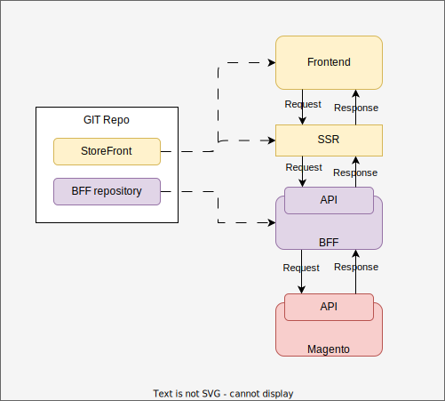

# 2.1. Introduction

## What's this module about?

This module marks the initial and crucial phase in the journey toward the implementation of the Composable Platform.

In most cases, clients are unable to abandon their legacy systems and shift entirely to a new one through a single major release (big bang approach). Consequently, this transition is broken down into incremental steps, each contributing to the final outcome. From a technical standpoint, one effective method for achieving this is by using the Strangler pattern.

The primary objective of this trial is to establish a component that leverages the Strangler pattern. This layer serves as an intermediary between the existing Magento system and the future MACH components that will be introduced in the following trails.

### So, what exactly is the Strangler Pattern?

The Strangler Pattern is a software development approach that involves gradually replacing parts of an existing system with new components over time, without requiring a complete rewrite. This strategy ensures a smoother transition from the old system to the new one. For a more detailed explanation and visual representation of the pattern, you can refer to the diagram provided in this article: [Link to the Article](https://learn.microsoft.com/en-us/azure/architecture/patterns/strangler-fig).

## What you will do?

You will develop a BFF service that reflects the ideal scenario of interaction for a typical e-commerce application, serving as an intermediary between the Magento API and the storefront, ensuring efficient data transmission and seamless integration between them.

### What is BFF and you might consider using this?

BFF stands for "Backend For Frontend." It's a design pattern where a dedicated backend service is created to cater to the needs of a specific front-end application/channel. The BFF pattern helps optimize and customize data and functionality for a particular front end, enhancing the overall user experience. To better understand BFF and its benefits, you can refer to the diagram provided in this article: [Link to the Article](https://learn.microsoft.com/en-us/azure/architecture/patterns/backends-for-frontends).

## Which NFRs should you follow to achieve composable architecture?

This layer should adhere to several Non-Functional Requirements (NFRs) to ensure its effectiveness, performance, and usability. Here are some Non-Functional Requirements (NFRs) that should be considered within the context of MACH architecture:

Throughout this course, our primary focus will be on **Maintainability** and **Consistency**. Understanding how to effectively organize code to align with MACH principles is essential. This approach ensures not only the present system's stability but also sets the foundation for seamless future enhancements and system evolution.

One of the challenges in such migrations is ensuring that the URLs from the legacy system remain the same. This is crucial for maintaining SEO rankings and must be carefully addressed during the migration process.

## Design of solution

+ When your application requires complex data aggregation from multiple backend services before rendering the page. BFF can act as an intermediary that fetches data from various APIs, aggregates it, and sends it to the frontend for rendering.
+ In a microservices architecture where different services handle specific functionalities, BFF can simplify frontend development by providing a unified API for the frontend to interact with multiple microservices.
+ When you need fine-grained control over API requests and responses for optimizing frontend performance. BFF allows tailoring API requests to specific frontend components, reducing over-fetching or under-fetching of data.

+ If you have separate teams working on the frontend for different channels, it may be more efficient to use BFF to handle the channel-specific logic, allowing each team to focus on their area of expertise.

+ When security is a concern BFF can act as a security layer between the frontend and backend services, enforcing security policies consistently across all channels.

## Prerequisites

- Magento is working as expected. Magento should be configured and prepared [Module 1: Magento setup](/docs/basic-magento-store/practical-task-2-majento-setup)
- StoreFront application should be configured [Module 1: Configure StoreFront](/docs/basic-magento-store/practical-task-5-configure-storeFront)
