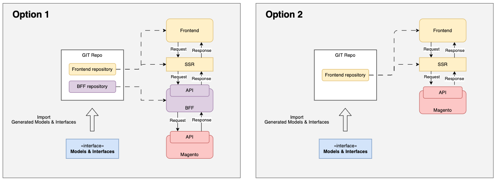

# 1.3. Definition of Done for Practical Tasks

:::info
Definition of Done for Practical Tasks:

+ The page should match the wireframe's appearance.
+ All data should be pulled from Magento.
+ Follow the given Interfaces and Models for implementation.
:::

The diagram below shows what should you have after finishing this Trail.

Consideration between the options above:

1. Option 1 - Both BFF and SSR are separate applications
   + When your application requires complex data aggregation from multiple backend services before rendering the page. BFF can act as an intermediary that fetches data from various APIs, aggregates it, and sends it to the frontend for rendering.
+ In a microservices architecture where different services handle specific functionalities, BFF can simplify frontend development by providing a unified API for the frontend to interact with multiple microservices.
+ When you need fine-grained control over API requests and responses for optimizing frontend performance. BFF allows tailoring API requests to specific frontend components, reducing over-fetching or under-fetching of data.

+ If you have separate teams working on the frontend for different channels, it may be more efficient to use BFF to handle the channel-specific logic, allowing each team to focus on their area of expertise.

+ When security is a concern BFF can act as a security layer between the frontend and backend services, enforcing security policies consistently across all channels.

1. Option 2 - SSR with API functions

+ For simpler applications with straightforward data retrieval requirements, SSR alone may be sufficient. It can directly fetch data from the backend and render pages without the need for an additional BFF layer.
+ In cases where performance is critical, SSR can be more efficient as it eliminates an extra hop through the BFF layer. SSR can directly retrieve data from the backend and render pages on the server, reducing frontend load times.
+ Avoiding the development and maintenance overhead of a BFF layer might be more cost-effective.
+ When an application primarily relies on a single backend service or API for data, SSR alone can suffice.