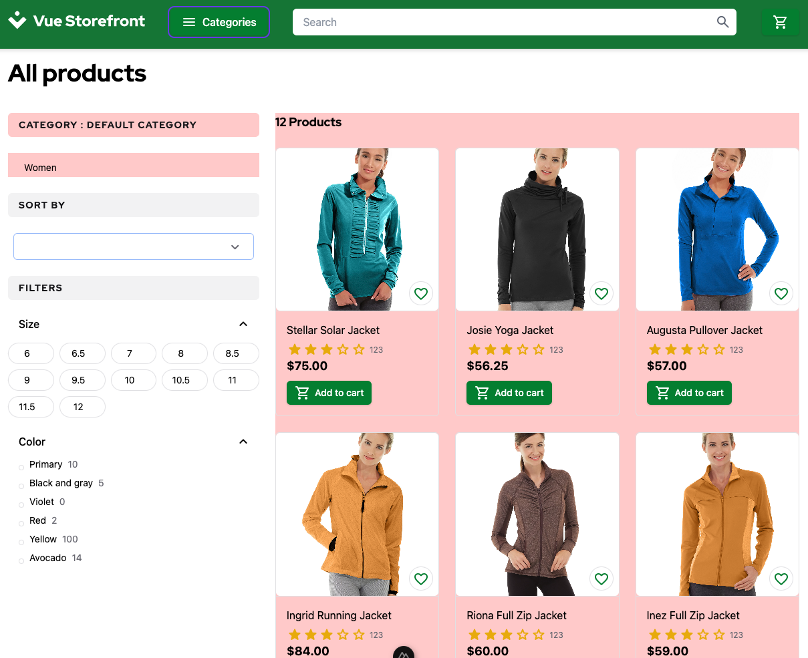

# 2.3. Practical Task - Implement Product Listing Page (PLP)

## What is this task about

This task is aimed at developing server-side logic for the Product Listing Page (PLP) in a store running on the Magento platform. Your task will involve creating the server-side component responsible for handling client requests and sending them responses with the necessary data.

#### A typical PLP logic:


#### Typical UI components:


## What should be done

You need to implement PLP logic that will pull data from Magento and provide it to StoreFront.

- Data fetched from Magento.
  - Categories
  - Products
- Storefront should use your BFF API instead of mocks

#### PLP in the StoreFront

The Product List Page is already implemented in the StoreFront application and available under `/category` path.




## Task

1. Develop a server API endpoint dedicated to providing product categories on the store's Product Listing Page (PLP). This endpoint should return a list of categories with a hierarchy.
- The data must be retrieved from the Magento API (f.e. [get categories](https://adobe-commerce.redoc.ly/2.4.7-admin/tag/categories#operation/GetV1Categories))  
- The StoreFront must use `GET /categories` endpoint. The root category is a category with property `parent` equal to `null`, or without that property at all. 

    ```json
    {
        "id": 2,
        "name": "Default Category",
        "description": "Default Category",
        "slug": "2",
        "parent": null,
        "ancestors": []
    }
    ```
    Please refer to request **Get Categories** in the [StoreFront Postman Collection](https://git.epam.com/EPAM-JS-Competency-center/camp-storefront-nuxt/-/tree/main/postman) to find example of the request and response.

2. Develop a server API endpoint dedicated to providing products by category on the store's Product Listing Page (PLP). This endpoint should return a list of products under the selected category.
- The data must be retrieved from the Magento API (f.e. [get products](https://adobe-commerce.redoc.ly/2.4.7-admin/tag/products#operation/GetV1Products))
- The Storefront must use `GET /products?categoryId=$active_category_id` endpoint. The endpoint should support query parameters `page` and `offset` for the pagination. Please refer to request **Get Products by Category** in the [StoreFront Postman Collection](https://git.epam.com/EPAM-JS-Competency-center/camp-storefront-nuxt/-/tree/main/postman) to find example of the request and response.
