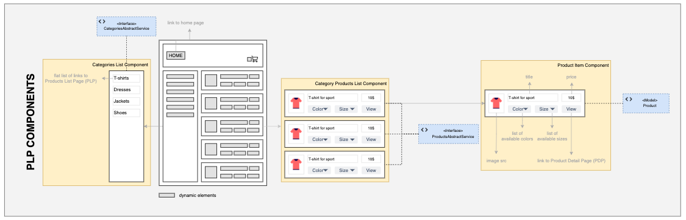

# 1.4. Step 1. Practical Task - Implement Product Listing Page (PLP)

### Definition of Done

You need to implement PLP logic that will pull data from Magento and provide it to StoreFront.

- Data fetched from Magento.
- PLP logic integrated into Storefront.
- Categories displayed with clickable links.
- Product list shown per category.
- Filtering by category functional.

### A typical PLP Wireframe:

To facilitate your journey through the efficient development process of BFF implementation, specifically designed to uphold Maintainability requirements, we have prepared a number of Interfaces and Models that are typical for the E-Commerce and retail domain. Below you can find an illustration of how those Models and Interfaces are related to UI components for the PLP page.

