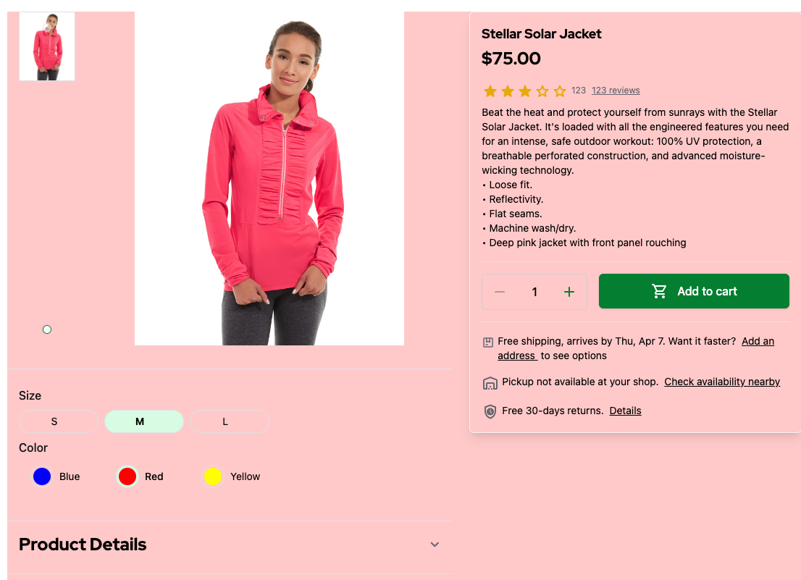

# 2.4. Practical Task - Implement Product Detail Page (PDP)

## What is this task about

This task is aimed at developing server-side logic for a Product Detail Page (PDP) in a store running on the Magento platform. Your role will be to develop a server-side component that is tasked with managing customer requests and providing them with the necessary data in the responses.

#### A typical PDP logic:

#### Typical UI components:

## What should be done

You need to implement PDP logic that will pull data from Magento and provide it to StoreFront.

- Data fetched from Magento.
  - Product
- Storefront should use your BFF API instead of mocks

#### PDP in the StoreFront

The Product Details Page is available in the StoreFront application under path `/products/$sku`.

## Task

1. Develop a server API endpoint dedicated to providing product information on the store's Product Details Page (PDP). This endpoint should return product information by SKU.
- The data must be retrieved from the Magento API (f.e. [get product by SKU](https://adobe-commerce.redoc.ly/2.4.7-admin/tag/productssku#operation/GetV1ProductsSku))
- The StoreFront must use `GET /products/$sku` endpoint. Please refer to request **Get Product by id (SKU)** in the [StoreFront Postman Collection](https://git.epam.com/EPAM-JS-Competency-center/camp-storefront-nuxt/-/tree/main/postman) to find example of the request and response.

#### Note: On the current phase you need to implement only one endpoint that loads Product Details by the `sku`
