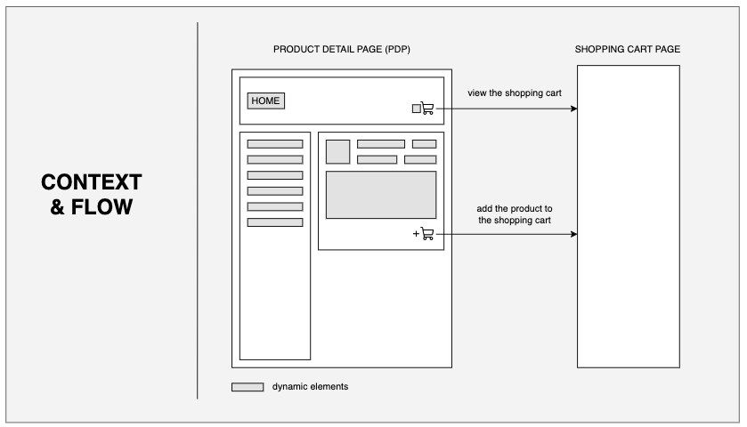
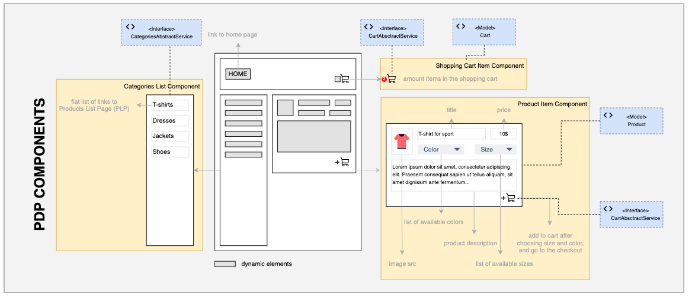

# 1.5. Step 2. Practical Task - Implement Product Detail Page (PDP)

### A typical PDP Wireframe:

Below is an illustration of Models and Interfaces that are related to UI components on the PDP page.

