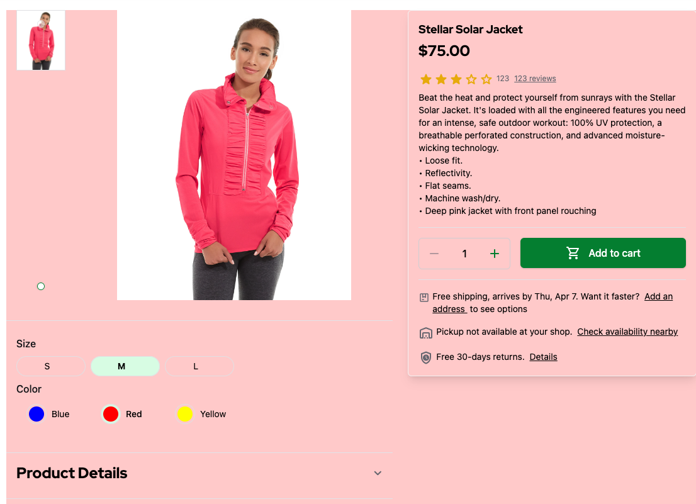

# 2.5. Practical Task - Implement Product Detail Page (PDP)

:::warning
- ~TODO: add Open API of StoreFront that should be integrated during this task - Vasiliy~
- ~TODO2: add StoreFront context, example in task - Vasiliy~
- TODO3: add magenta end-points - Yaroslav
- TODO4: Add acceptance - Yaroslav
:::

### Definition of Done

You need to implement PDP logic that will pull data from Magento and provide it to StoreFront.

- Data fetched from Magento.
- PDP logic integrated into Storefront.
- Product details shows
- Products custom attibutes shows

### A typical PDP Wireframe:

Below is an illustration of Models and Interfaces that are related to UI components on the PDP page.

### PDP in the StoreFront

The Product Details Page is available in the StoreFront application under path `/products/$sku`.

### Endpoints for PDP
On the current phase you need to implement only one endpoint that loads Product Details by the `sku`

#### GET /products/$sku
Please refer to request **Get Product by id (SKU)** in the [StoreFront Postman Collection](https://git.epam.com/Vasily_Vanin/camp-storefront-nuxt/-/tree/main/postman) to find example of the request and response.
