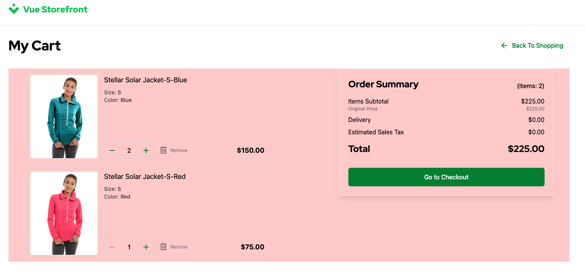

# 2.5. Practical Task - Implement Shopping Cart

## What is this task about

This task involves developing a server-side API for managing the shopping cart. You'll need to create a server component that handles client requests related to adding, removing, or modifying items in the cart, as well as providing necessary information about the cart's contents.

#### A typical Cart logic:


#### Typical UI components:


## What should be done

You need to implement a shopping cart that will be based on the Magento API and give that control to StoreFront.

- Card CRUD that managed by Magento.
  - Create cart
  - Get cart
  - Update car
    - Add line item
    - Change quantity
    - Remove item
- Storefront should use your BFF API instead of mocks

#### Cart in the StoreFront

The Cart is implemented and available in the StoreFront under path `/cart`. The users can add, remove or change items from this page. Finally, the users can proceed to the Checkout page, which is just a link to another page and it doesn't require anything on the API level. Until the Order is submitted from the Checkout page the users are allowed to change their carts.




# Task


### Endpoints for the Cart feature


1. Develop a server API endpoint dedicated to creating a shopping cart. This endpoint should return a cart with items.
- The cart must be created in Magento (f.e. [creat guest cart](https://adobe-commerce.redoc.ly/2.4.7-admin/tag/guest-carts#operation/PostV1Guestcarts))
- The StoreFront must use `POST /carts` endpoint to create a new guest cart. It creates a new cart every time if it's not found in the Browser's local storage, otherwise it would request a cart details by id. This endpoint doesn't expect any payload. Please refer to request **Post Cart** in the [StoreFront Postman Collection](https://git.epam.com/EPAM-JS-Competency-center/camp-storefront-nuxt/-/tree/main/postman) to find example of the request and response.


2. Develop a server API endpoint dedicated to getting a shopping cart. This endpoint should return a guest cart.
- The data must be retrieved from the Magento API (f.e. [get cart by id](https://adobe-commerce.redoc.ly/2.4.7-admin/tag/guest-cartscartId#operation/GetV1GuestcartsCartId), [get cart items](https://adobe-commerce.redoc.ly/2.4.7-admin/tag/guest-cartscartIditems#operation/GetV1GuestcartsCartIdItems))
- The StoreFront must use `GET /carts/$id` endpoint. As said above, when the StoreFront finds cached cart in the Browser's local storage it tries to request the current data from the API. Please refer to request **Get Cart** in the [StoreFront Postman Collection](https://git.epam.com/EPAM-JS-Competency-center/camp-storefront-nuxt/-/tree/main/postman) to find example of the request and response.

3. Develop a server API endpoint dedicated to updating a shopping cart. This endpoint provides several actions based on the payload, we will cover it one by one in the sections below. You need to implement PUT /carts/$id endpoint.

    a. Develop a part that is related to adding line items to the shopping cart.
    - The line item should be added in Magento (f.e. [add line item](https://adobe-commerce.redoc.ly/2.4.7-admin/tag/guest-cartscartIditems#operation/PostV1GuestcartsCartIdItems))
    - The StoreFront uses this endpoint to add the item to the cart if there is no item already added. Please refer to request **Put Cart / AddLineItem** in the [StoreFront Postman Collection](https://git.epam.com/EPAM-JS-Competency-center/camp-storefront-nuxt/-/tree/main/postman) to find example of the request and response. Example payload:
    ```json
    {
        "version": 1,
        "action": "AddLineItem",
        "AddLineItem": {
            "variantId": "MH01-XS-Black",
            "quantity": 2
        }
    }
    ```

    b. Develop a part that is related to updating the quantity of items.
    - Quantity should be changed in Magento (f.e. [change quantity](https://adobe-commerce.redoc.ly/2.4.7-admin/tag/guest-cartscartIditemsitemId#operation/PutV1GuestcartsCartIdItemsItemId))
    - The StoreFront uses this endpoint to change the quantity of the item into the cart. When adding the same item into the cart or changing the quantity of existing item on the Cart page, the StoreFront sends request with `ChangeLineItemQuantity` action. Please refer to request **Put Cart / ChangeLineItemQuantity** in the [StoreFront Postman Collection](https://git.epam.com/EPAM-JS-Competency-center/camp-storefront-nuxt/-/tree/main/postman) to find example of the request and response. Example payload:
    ```json
    {
        "version": 2,
        "action": "ChangeLineItemQuantity",
        "ChangeLineItemQuantity": {
            "lineItemId": 54,
            "quantity": 4
        }
    }
    ```

    c. Develop a part that is related to removing line items from the shopping cart.
    - The line item should be removed from Magento (f.e. [remove item](https://adobe-commerce.redoc.ly/2.4.7-admin/tag/guest-cartscartIditemsitemId#operation/DeleteV1GuestcartsCartIdItemsItemId))
    - The StoreFront uses this endpoint to remove the line item from the shopping cart. This actions is available on the Cart page and triggered when user removes item from the Cart. Please refer to request **Put Cart / RemoveLineItem** in the [StoreFront Postman Collection](https://git.epam.com/EPAM-JS-Competency-center/camp-storefront-nuxt/-/tree/main/postman) to find example of the request and response. Example payload:
    ```json
    {
        "version": 3,
        "action": "RemoveLineItem",
        "RemoveLineItem": {
            "lineItemId": 54,
            "quantity": 1
        }
    }
    ```

#### Note: For simplicity, after the successful operation the StoreFront will just reload the cart.

