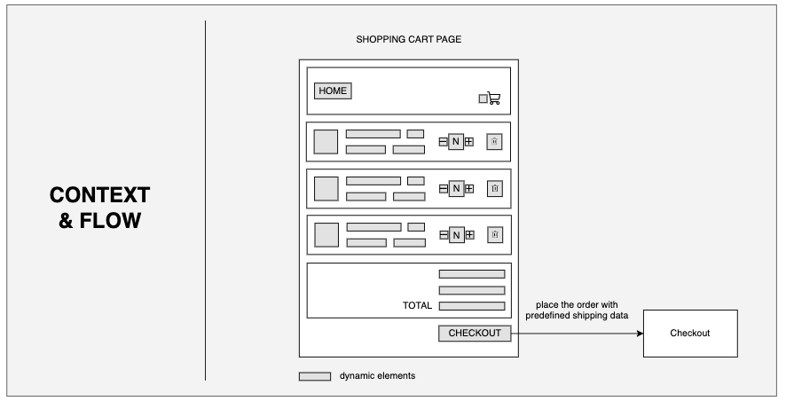
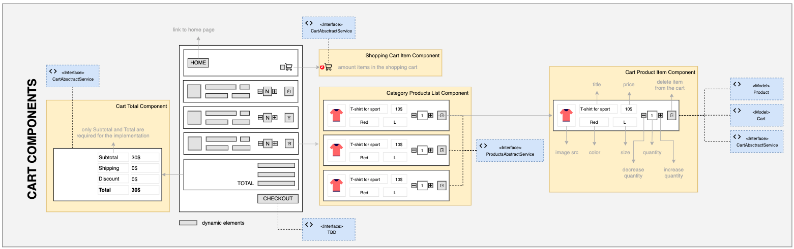
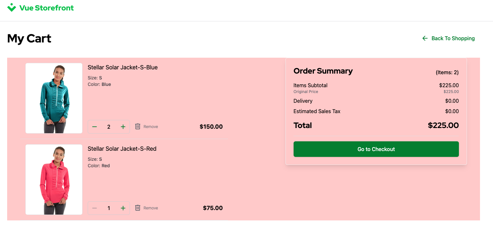

# 2.6. Practical Task - Implement Cart Page

:::warning
- ~TODO: add Open API of StoreFront that should be integrated during this task - Vasiliy~
- ~TODO2: add StoreFront context, example in task - Vasiliy~
- TODO3: add magenta end-points - Yaroslav
- TODO4: add acceptance - Yaroslav
:::

### Definition of Done

...

- 1
- 2
- 3

### A typical PDP Wireframe:



Below is an illustration of Models and Interfaces that are related to UI components on the Cart page.



### Cart in the StoreFront

The Cart is implemented and available in the StoreFront under path `/cart`. The users can add, remove or change items from this page. Finally, the users can proceed to the Checkout page, which is just a link to another page and it doesn't require anything on the API level. Until the Order is submitted from the Checkout page the users are allowed to change their carts.



### Endpoints for the Cart feature

#### POST /carts
This StoreFront is using this endpoint to create a new guest cart. It creates a new cart every time if it's not found in the Browser's local storage, otherwise it would request a cart details by id.

This endpoint doesn't expect any payload.

Please refer to request **Post Cart** in the [StoreFront Postman Collection](https://git.epam.com/Vasily_Vanin/camp-storefront-nuxt/-/tree/main/postman) to find example of the request and response.

#### GET /carts/$id
As said above, when the StoreFront finds cached cart in the Browser's local storage it tries to request the current data from the API. This endpoint should return a cart with items.

Please refer to request **Get Cart** in the [StoreFront Postman Collection](https://git.epam.com/Vasily_Vanin/camp-storefront-nuxt/-/tree/main/postman) to find example of the request and response.

#### PUT /carts/$id

This endpoint provides several actions based on the payload, we will cover it one by one in the sections below.

**Note:** For simplicity, after the successful operation the StoreFront will just reload the cart.


##### Add Line Item
The StoreFront uses this endpoint to add the item into the cart if there is no item already added.

Example payload:
```json
{
    "version": 1,
    "action": "AddLineItem",
    "AddLineItem": {
        "variantId": "MH01-XS-Black",
        "quantity": 2
    }
}
```

Please refer to request **Put Cart / AddLineItem** in the [StoreFront Postman Collection](https://git.epam.com/Vasily_Vanin/camp-storefront-nuxt/-/tree/main/postman) to find example of the request and response.

##### Change Quantity
When adding the same item into the cart or changing the quantity of existing item on the Cart page, the StoreFront sends request with `ChangeLineItemQuantity` action. 

Example payload:
```json
{
    "version": 2,
    "action": "ChangeLineItemQuantity",
    "ChangeLineItemQuantity": {
        "lineItemId": 54,
        "quantity": 4
    }
}
```

Please refer to request **Put Cart / ChangeLineItemQuantity** in the [StoreFront Postman Collection](https://git.epam.com/Vasily_Vanin/camp-storefront-nuxt/-/tree/main/postman) to find example of the request and response.

##### Remove Item
This actions is available on the Cart page and triggered when user removes item from the Cart.

Example payload:
```json
{
    "version": 3,
    "action": "RemoveLineItem",
    "RemoveLineItem": {
        "lineItemId": 54,
        "quantity": 1
    }
}
```

Please refer to request **Put Cart / RemoveLineItem** in the [StoreFront Postman Collection](https://git.epam.com/Vasily_Vanin/camp-storefront-nuxt/-/tree/main/postman) to find example of the request and response.

