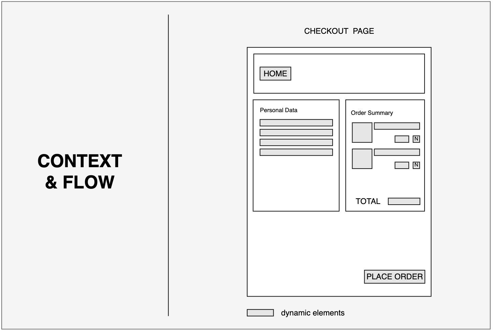
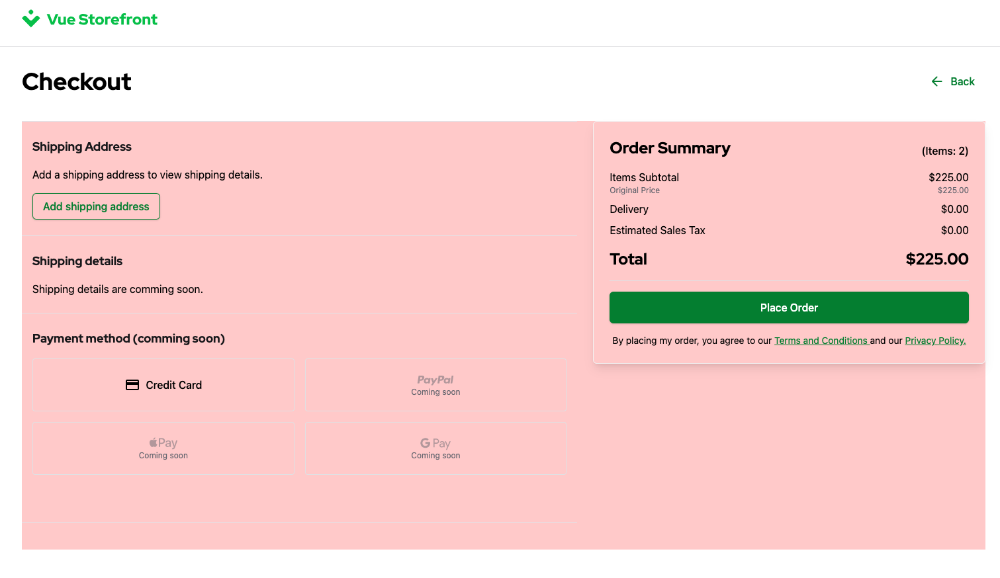
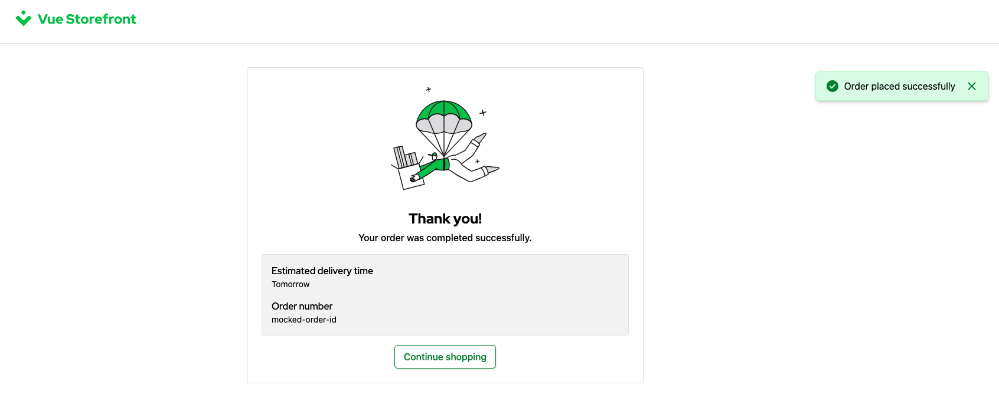

# 2.6. Practical Task - Implement Checkout Flow

## What is this task about

This task is aimed at developing server-side logic for a checkout flow in a store running on the Magento platform. Your role will be to develop a server-side component whose task is to place an order.

#### A typical PDP Wireframe:



#### Typical UI components:


## What should be done

You need to implement a checkout flow that will be based on the Magento API and give that control to StoreFront.

- Creating offer that managed by Magento
  - Set shipping address
  - Create order
- Storefront should use your BFF API instead of mocks

#### The Checkout in the StoreFront
To start the start checkout the users click on the button in the Shopping Cart. The checkout consists of two major steps.

#### Add Shipping Details



#### Users can edit the Address before the order is submitted


#### Submit the order



## Task

1. Extend a server API endpoint `PUT /carts/$id` to set the shipping address that is required for the offer. This endpoint should be already implemented in your API by the previous [task](/docs//2-BFF-and-new-frontend/06-practical-task-3-cart.md). At this stage, you need to add one more action `SetShippingAddress`.
- Shipping address must be updated in Magento (f.e. [set shipping address](https://adobe-commerce.redoc.ly/2.4.7-admin/tag/guest-cartscartIdshipping-information#operation/PostV1GuestcartsCartIdShippinginformation))
- The StoreFront uses this endpoint to update shipping address in the cart. Please refer to request **Put Cart / SetShippingAddress** in the [StoreFront Postman Collection](https://git.epam.com/EPAM-JS-Competency-center/camp-storefront-nuxt/-/tree/main/postman) to find example of the request and response. Example Payload:
```json
{
    "version": 5,
    "action": "SetShippingAddress",
    "SetShippingAddress": {
        "country": "DE",
        "firstName": "TestName",
        "lastName": "TestSurname",
        "streetName": "Test Street Name",
        "streetNumber": "13",
        "postalCode": "10285",
        "city": "Berlin",
        "region": "Berlin",
        "email": "jonh_doe@example.com"
    }
}
```

2. Develop a server API endpoint dedicated to creating an offer. This endpoint finalizes the cart and creates a new orded from it. It doesn't require any payload as all the information should be provided in the cart.
- The offer must be created in Magento (f.e. [create offer](https://adobe-commerce.redoc.ly/2.4.7-admin/tag/guest-cartscartIdorder#operation/PutV1GuestcartsCartIdOrder))
- The StoreFront must use `POST /carts/$id/order` endpoint to create an offer. Please refer to request **Create Order From Cart** in the [StoreFront Postman Collection](https://git.epam.com/EPAM-JS-Competency-center/camp-storefront-nuxt/-/tree/main/postman) to find example of the request and response.