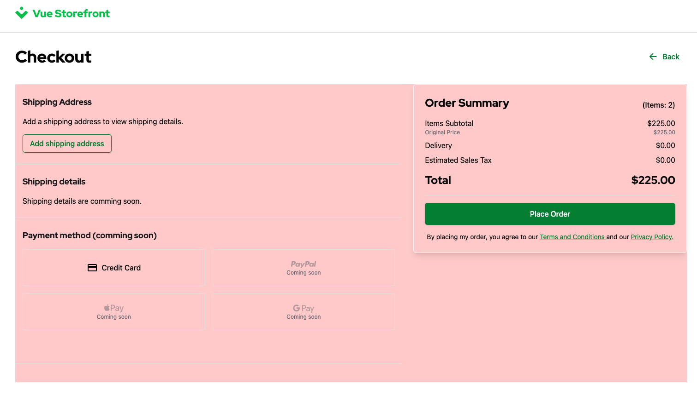
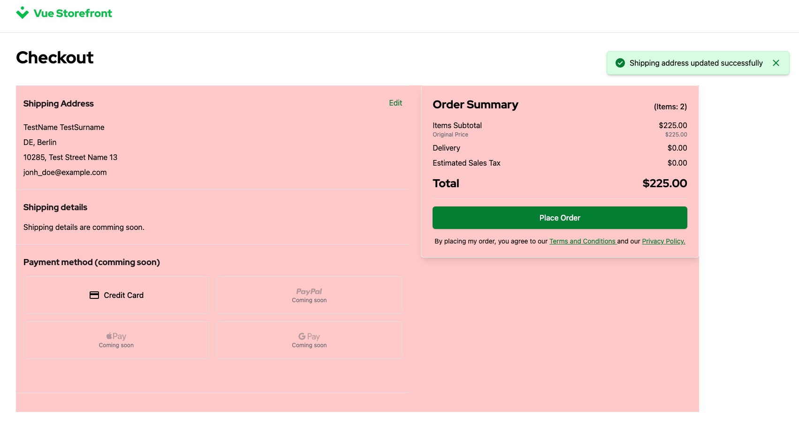
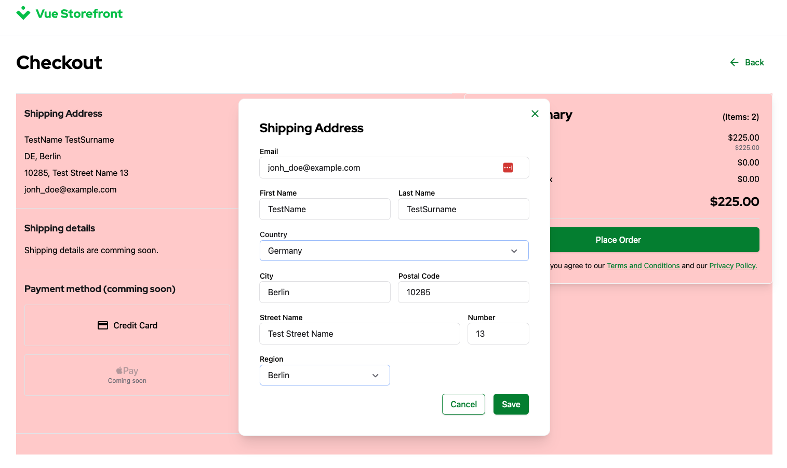
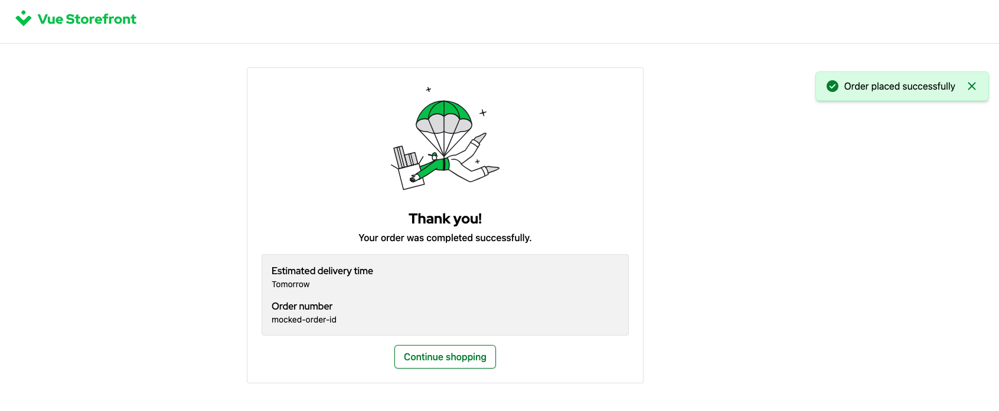

# 2.7. Practical Task - Implement Checkout

:::warning
- ~TODO: add Open API of StoreFront that should be integrated during this task - Vasiliy~
- ~TODO2: add StoreFront context, example in task - Vasiliy~
- TODO3: add magenta end-points - Yaroslav
- TODO4: add acceptance - Yaroslav
:::

### Definition of Done

...

- 1
- 2
- 3

### A typical PDP Wireframe:


Below is an illustration of Models and Interfaces that are related to UI components on the Checkout page.


### The Checkout in the StoreFront
To start the start the checkout the uses click on the button in the Shopping Cart. The checkout consists of two major steps.

#### Add Shipping Details



#### Users can edit the Address before the order is submitted


#### Submit the order


### Endpoints for Checkout
There are two endpoints needed for the Checkout.

#### PUT /carts/$id
This endpoint should be already implemented in your API. On this stage you need to add one more action `SetShippingAddress`

Example Payload:
```json
{
    "version": 5,
    "action": "SetShippingAddress",
    "SetShippingAddress": {
        "country": "DE",
        "firstName": "TestName",
        "lastName": "TestSurname",
        "streetName": "Test Street Name",
        "streetNumber": "13",
        "postalCode": "10285",
        "city": "Berlin",
        "region": "Berlin",
        "email": "jonh_doe@example.com"
    }
}
```
Please refer to request **Put Cart / SetShippingAddress** in the [StoreFront Postman Collection](https://git.epam.com/Vasily_Vanin/camp-storefront-nuxt/-/tree/main/postman) to find example of the request and response.

#### POST /carts/$id/order
This endpoint finalizes the cart and creates a new orded from it. 
It doesn't require any payload as all the information should be provided in the cart.

Please refer to request **Create Order From Cart** in the [StoreFront Postman Collection](https://git.epam.com/Vasily_Vanin/camp-storefront-nuxt/-/tree/main/postman) to find example of the request and response.