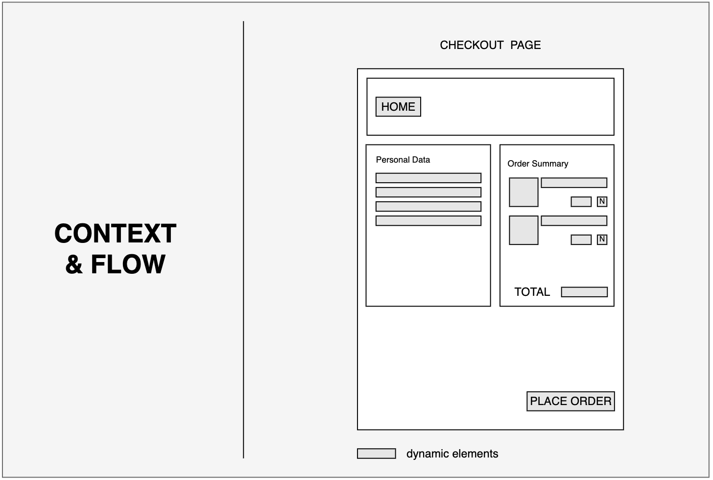
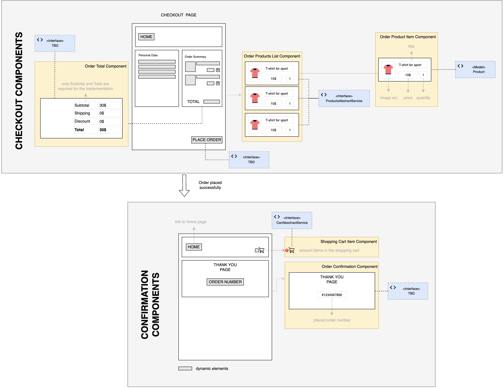

# 2.7. Practical Task - Implement Checkout

:::warning
- TODO: add Open API of StoreFront that should be integrated during this task - Vasiliy
- TODO2: add StoreFront context, example in task - Vasiliy
- TODO3: add magenta end-points - Yaroslav
- TODO4: add acceptance - Yaroslav
:::

### Definition of Done

...

- 1
- 2
- 3

### A typical PDP Wireframe:

Below is an illustration of Models and Interfaces that are related to UI components on the Checkout page.

