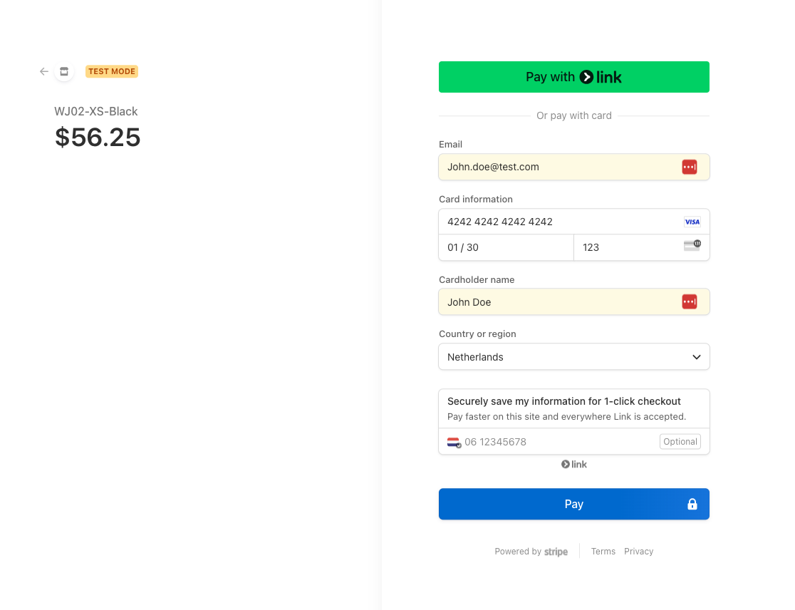
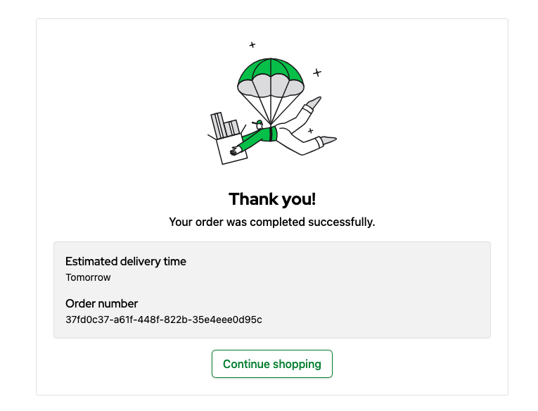

# 2.7. Practical Task - Implement Stripe Checkout

## What is this task about

This task is aimed at developing server-side logic for a checkout flow in a store running on the Magento platform. Your role will be to develop a server-side component whose task is to place an order.

## What should be done

You need to implement Stripe checkout-session that will be used on the StoreFront side.

- Creating session that managed by Stripe
- Storefront should use your BFF API to proceed payment
- Update BFF API to implement payment flow with redirect
- Update checkout flow to confirm order in E-Commerce solution

### Create Stripe account
To start proceeding payments - create your own test Stripe account.
Registration: https://dashboard.stripe.com/register

After your account is created, you can start accepting payments in Test mode, no additional setup is needed

### Stripe API Keys
To access Strip APIs you need API keys. Test keys are already available in your dashboard. To access your keys click on the **Developers** menu
on left bottom corner. And then click on **API keys** item. 


On the next page you can find a pair of keys already generated for you by Stripe. You can use the provided keys. For the BFF only Secret Key is required.


### Manage Order's state
Initially the order is created with `orderState: "Open"` and with empty Payment Status.


There are more states in the Order Lifecycle like: *Confirmed*, *Complete*, *Cancelled*. Depending on your flow you can 
move order among the states.

Additionally, Payment Status and Shipment Status are managed separately. In this module we will focus only on **Payment Status**.


## Task
On the diagram below you can find a flow diagram that illustrates the process. 


When user clicks on the **Place Order** button, the storefront sends following request to the BFF API with empty body:
```
POST ${BFF_URL}/carts/:cartId/order
```
For example:
```
http://localhost:3003/api/v1/carts/b111ec1e-5a06-47d5-ac9b-02186191e6fa/order
```
The api should answer with following object:

<details>
    <summary>Show Typescript definition</summary>

```typescript
    export interface Order {
      /**
       *
       * @type {string}
       * @memberof Order
       */
      id: string
      /**
       *
       * @type {number}
       * @memberof Order
       */
      version?: number
      /**
       *
       * @type {string}
       * @memberof Order
       */
      customerId?: string
      /**
       *
       * @type {string}
       * @memberof Order
       */
      customerEmail?: string
      /**
       *
       * @type {Array<OrderLineItemsInner>}
       * @memberof Order
       */
      lineItems?: Array<OrderLineItemsInner>
      /**
       *
       * @type {OrderTotalPrice}
       * @memberof Order
       */
      totalPrice?: OrderTotalPrice
      /**
       *
       * @type {number}
       * @memberof Order
       */
      totalQuantity?: number
      /**
       *
       * @type {Address}
       * @memberof Order
       */
      billingAddress?: Address
      /**
       *
       * @type {Address}
       * @memberof Order
       */
      shippingAddress?: Address
      /**
       * Cart Id
       * @type {string}
       * @memberof Order
       */
      origin?: string
      /**
       *
       * @type {string}
       * @memberof Order
       */
      orderState?: string
      /**
       *
       * @type {string}
       * @memberof Order
       */
      createdAt?: string
      /**
       *
       * @type {string}
       * @memberof Order
       */
      completedAt?: string
    }
```
</details>

Once the Storefront received order details it requests Payment session from the API:

```
POST ${BFF_URL}/payments/sessions
{
    "id": orderId
}
```
<details>
  <summary>Show example</summary>

```
POST http://localhost:3003/api/v1/payments/sessions

{
    "id":"37fd0c37-a61f-448f-822b-35e4eee0d95c"
}
```
</details>

The api should answer with following object:

```typescript
interface PaymentSession {
    /**
     * Unique payment session id
     * @type {string}
     * @memberof PaymentSession
     */
    id: string;
    /**
     * An URL to payment page to redirect user 
     * @type {string}
     * @memberof PaymentSession
     */
    url: string;
}
```
The user will be redirected to the payment page, and once the payment is successfully finished, the user will be redirected to order confirmation page.


Your task is to make sure that user is taken back to the following page after the payment:
```
http://localhost:3000/order/success?orderId=${orderId}
```
For example: 
```
http://localhost:3000/order/success?orderId=37fd0c37-a61f-448f-822b-35e4eee0d95c
```
The page will send request to confirm the payment:
```
PUT ${BFF_URL}/orders/:orderId
{
    "version": ${version},
    "actions":[{
        "action": "changePaymentState",
        "paymentState": "Paid"
    }, {
        "action": "changeOrderState",
        "orderState": "Confirmed"
    }]
}
```

<details>
    <summary>Show example</summary>

```
PUT http://localhost:3003/api/v1/orders/37fd0c37-a61f-448f-822b-35e4eee0d95c
{
    "version": 2,
    "actions":[{
        "action": "changePaymentState",
        "paymentState": "Paid"
    }, {
        "action": "changeOrderState",
        "orderState": "Confirmed"
    }]
}
```
</details>

After confirmation, the user should see following message:

