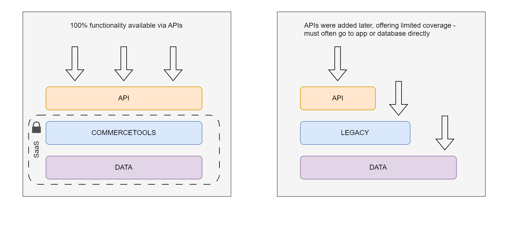
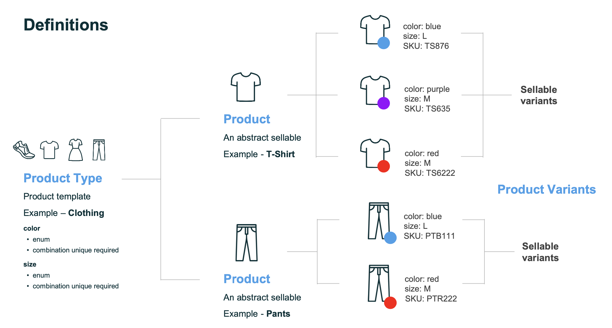
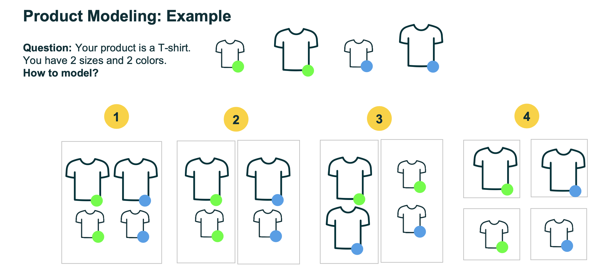
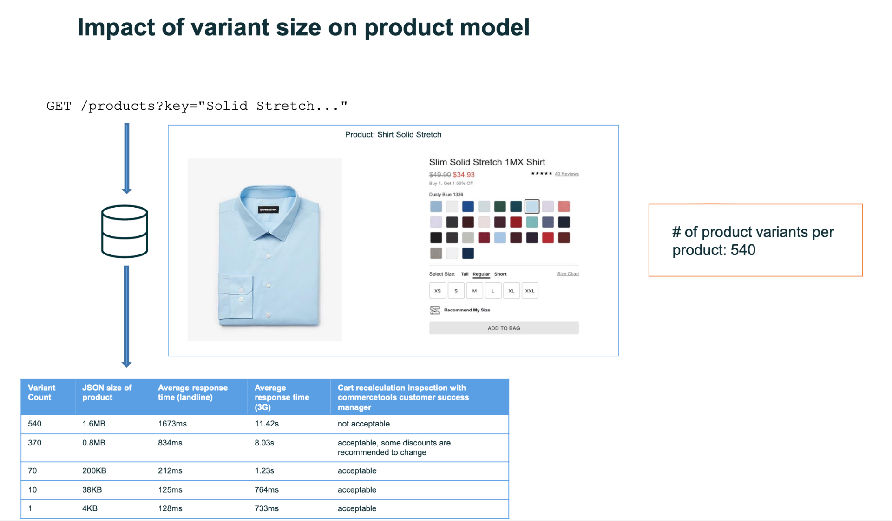

# 3.3 Commercetools at a very high level

:::warning
- TODO: moved to introduction - Andrii
:::

Commercetools company vision is to provide the products that growing and innovative companies need to build outstanding and scalable commerce experiences. They give customers a portfolio of commerce technologies at a fraction of the costs compared to building that in-house.
Commercetools was made with a strong focus on MACH principles, especially the "API-First" idea. This means all its features are built to be easily accessible through APIs. Plus, because it's a SaaS (Software as a Service) solution, it was created to work seamlessly with cloud technology right from the start.

## API and touchpoints

Commercetools offers various tools for developers to easily learn and start using the platform.

**[Github](https://github.com/commercetools)**: This is where you can find the source code for different Software Development Kits (SDKs) and examples. A tip: you can look in the test folder for examples of how to use different classes and functions, thanks to thorough testing.

**[Postman Collections](https://github.com/commercetools/commercetools-postman-collection)**: Commercetools provides ready-made sets of requests for their different APIs. These collections cover a wide range of possible requests you might make through the Composable Commerce API.

**[Documentation](https://docs.commercetools.com/api/)**: This is a go-to resource for any developer working with Commercetools. It's where you'll find detailed information on how to use the platform effectively.

**[Merchant Center](https://mc.commercetools.com/)**: This is a special application that helps you manage all aspects of your project within Commercetools.

**[Integration Marketplace](https://marketplace.commercetools.com/)**: Here, you'll find a range of different tools and integrations that can help speed up the process of connecting with other systems. This can be a real time-saver.

**[Playground](https://impex.commercetools.com)**: Playground where you could easily test APIs, and import/export data.

## Commercetools basics of product modelling

There are a few basic definitions that will explain the basics of product modelling in Commercetools and in e-commerce in general.

`Product Type`: Think of this as a class in Object-Oriented Programming (OOP).
It contains the essential properties your product. In the image below, for instance, the Product Type is identified as `Clothing`, which contains two additional attributes: `Color` and `Size`.

Depending on the Product Type, you can create specific items such as T-Shirts or Pants. However, selling just a T-Shirt without specifying both its Color and Size is not possible. To address this, Sellable Variants are used, which have defined attributes like a Blue T-Shirt in size M.

In e-commerce, the concept of master and variant products is crucial for managing products.

Product Variants are essentially different versions of a product that share some common attributes. In our example we are selling a t-shirt, the variants include different sizes (small, medium, large) and colors (red, blue, purple). Each variant has its own unique **`SKU`**, which is necessary for inventory management, for instance.

Product is the product that holds all the common information about the product. It typically contains details like the product name, description, images, and any attributes that are common across all variants (like brand name, material, etc.). In Commercetools product must contain at least one Product Variant.

:::info
- **`SKU`** stands for Stock Keeping Unit. It is a unique code or identifier assigned to each product in a retailer's inventory. This code is used to track and manage the product in the supply chain.
  :::

### How to model?

1. The first option suggests using one `Generic Product Type` for all variants and both `Siz`e and `Color` as attributes.
2. The second option recommends having a `Product Type` for each `Color`, and `Size` as an attribute.
3. The third option advises having a `Product Type` for each `Size`, and `Color` as an attribute.
4. The fourth option proposes having separate product types for each combination of color and size.

When defining the product data model, you should consider factors like the number of products, variants per product, update actions per product, how products will be displayed on the PLP, potential response size, bundling of products, publishing workflow, maintainability as the catalog grow, and the integration of data from the PIM system. This step is crucial and will impact nearly every aspect of the e-commerce business.

