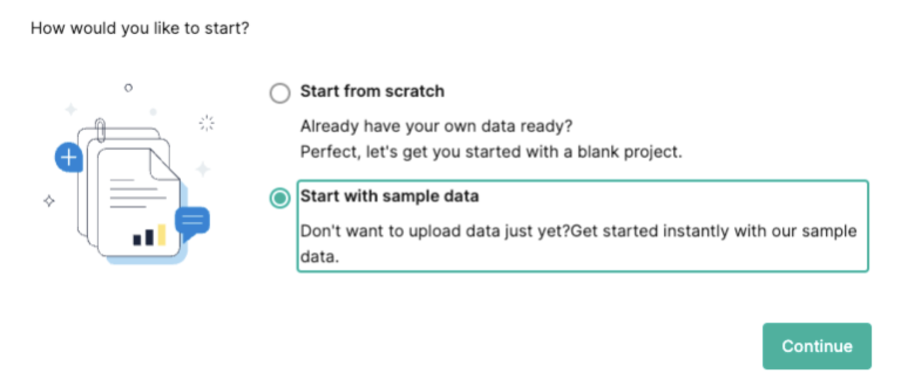
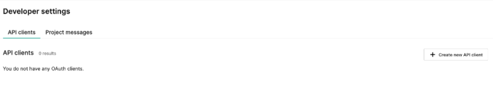

# 3.5. Practical Task - Commercetools initial setup

:::warning
- TODO: Fix migration (tax category) - Yaroslav
- TODO2: Move migration to separate task - Andrii
- TODO3: validate about storefront needed - Vasiliy
- TODO4: add acceptance - Andrii
:::

### What should be done

1. Once you've created an account, you'll have the option to initiate a project. During the project setup, select "**Start with sample data**".

2. Generate an API client to obtain the client_id and client_secret required for the authentication process.

3. Delete existing Categories and Products (otherwise, the migration script will fail).

4. Execute the script to migrate products from Magento to CT: **[Magento2-to-commercetools-lib](https://git.epam.com/Anton_Zhirkov/magento2-to-commercetools-lib)**

   - Rename `.env-copy` to `.env` and fill it with your creds 
   - Run `yarn` or `npm i`
   - Run *`yarn migrate-magento-to-comtools`*
   
5. **[Obtain an access token](https://docs.commercetools.com/api/authorization)** from Commercetools. Get access token from Commercetools.
6. Download and set up the **[Postman collection](https://docs.commercetools.com/sdk/postman)** by following the **[Instructions](https://github.com/commercetools/commercetools-postman-collection/blob/master/GettingStarted.md)** provided by Commercetools.
7. Activate Search in the **Settings > Storefront Search** to use endpoint "`product-projections/search?filter=categories.id:{id}`"  
