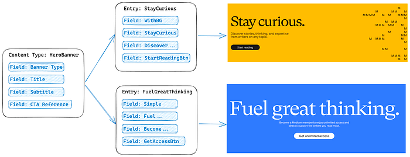
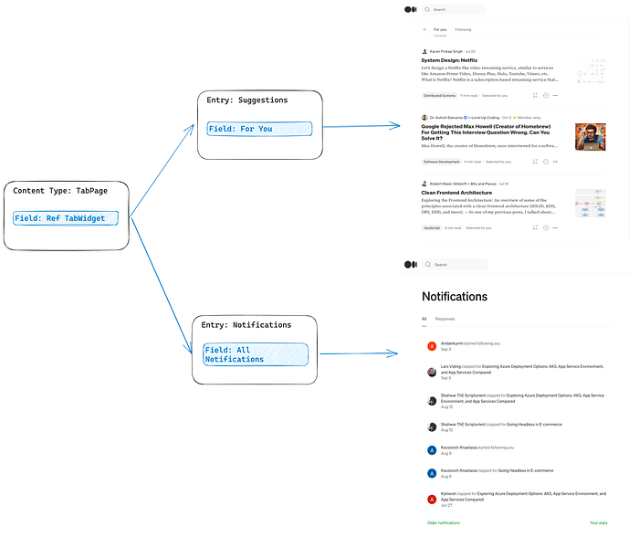
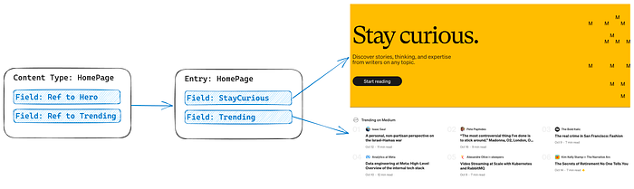
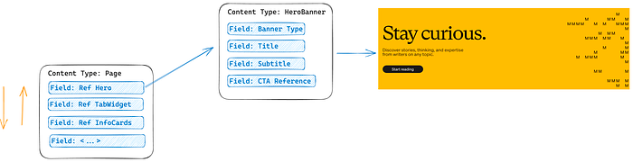

# 4.1. Introduction

:::warning
- TODO: add detailt to describe more about context of contentstack - Anton
- TODO2: add what will do / what module about (good example 2 module) - Anton
:::

This trail aims to integrate our application with the headless CMS and a member of MACH technologies: Contentstack.

### Contentstack at a very high level

Content Modelling overview: https://www.contentstack.com/docs/developers/content-modeling/about-content-modeling

Fundamental Building block - Content Type: https://www.contentstack.com/docs/developers/create-content-types/about-content-types

Fetching the content - https://www.contentstack.com/docs/developers/fetch-content

### Contentstack case studies:

https://wearecommunity.io/events/mach-case-study-experience-with-next-js-contentstack-and-contentstack-launch/talks/66332
https://wearecommunity.io/events/mach-partner-talk-contentstack-epam-and-ai-transforming-digital-experiences-together/talks/57455
https://wearecommunity.io/events/migration-from-aem-to-contentstack/talks/48618

### API and touchpoints

SDK - https://www.contentstack.com/docs/developers/sdks

APIs - https://www.contentstack.com/docs/developers/apis

Marketplace Apps - https://www.contentstack.com/docs/developers/marketplace-apps

### Contenstac basics of content modelling

In Contentstack, a key foundation is the Content Type. Think of it as a blueprint or template that defines the properties of your upcoming content piece. If you’re familiar with object-oriented programming, you can liken it to a class. With a Content Type, you can generate various Entries, which are actual content components complete with their own text, assets, and more.

In the diagram above, we see an example of utilizing Content Types and Entries.

Now, how can we structure this into pages? The answer lies in creating a Content Type that combines other content types.

**Page Template per Page Group**

Here’s the summary of what you need to do:

1. Identify pages with similar layouts and group them.
2. Create a content type for each group of pages.
3. Generate entries for each individual page.

Absolutely, it’s not the same for the homepage; it aims to be more appealing to the user.

Certainly, we’re aiming for greater flexibility to enable the movement of components within a page.

**Modular Blocks**

Modular blocks give content managers the flexibility to create rich pages without the need to engage a developer for changes in the content type structure.

So, now if we can change components order and modular block allows us to add a variety of components, we are able to create one generic page to handle all the cases. [Be aware of the limits!](https://www.contentstack.com/docs/developers/create-content-types/modular-blocks#limitations-of-modular-blocks)

