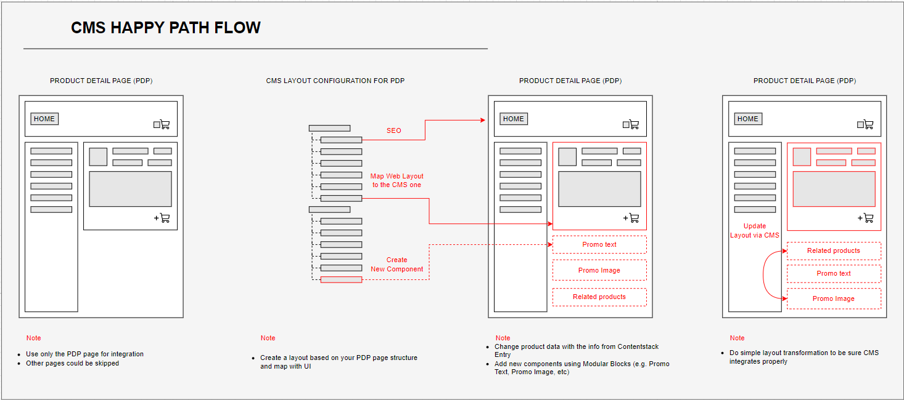

# 4.3. Definition of Done for Practical Tasks:

By completing these tasks, you will successfully integrate Contentstack into your application, ensuring it can fetch and display content from the CMS according to your application's requirements.

- Contentstack Integration: Implementing Contentstack integration into your application, replacing any existing mock data with dynamic content fetched from Contentstack.
- Data Retrieval: Ensuring your application can retrieve data seamlessly from Contentstack, such as text, images, videos, etc., as required.
- Data Presentation: Presenting the fetched data in the necessary format within your application, including formatting text, resizing images, and displaying multimedia content appropriately.
- Content Type Configuration: Setting up the required content types in Contentstack to organize your content effectively for your application's needs.
- Entity Configuration: Configuring Contentstack entities, like entries and assets, to match your application's structure and requirements, including defining fields, establishing relationships between content types, and configuring access permissions.
- UI Customization: Configuring Contentstack entities to allow for flexible UI customization, enabling options to tailor how different types of content are displayed within your application's user interface.

