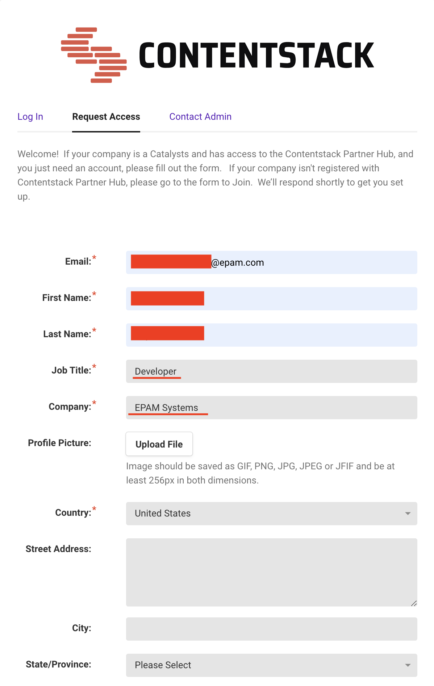

# 4.4. Practical Task - Contentstack initial setup

To get started, you'll need access to the Contentstack partner hub and Contentstack academy. Follow these steps:

1. **Register an Account:**
   - Use your EPAM email to register: [Access Request.](https://contentstack.channeltivity.com/RequestAccess)
   - Fill in all the required details and select the developer role.
     
   - Submit the form.
   - Please be patient as approval might take some time (even 2-3 days).
   - Once approved, you'll receive a confirmation via email.
2. **Validate and Log In:**
   - Confirm your account and log in to the PartnerHub portal: [PartnerHub.](https://contentstack.channeltivity.com/Login?target=%2FHome)
3. **Access Contentstack Academy:**
   - Log in to Contentstack Academy and explore the available courses: [Contentstack Academy.](https://www.contentstack.com/academy)

#### Additionally, for API testing and integration, follow these steps:

1. **Get Postman Collection:**
   - Download the Postman collection from [here](https://www.contentstack.com/docs/developers/apis/postman-collections).
2. **Authentication Tokens:**
   - Obtain the necessary tokens from `Settings => Tokens`. You can either use an existing token or create a new one.
   - Copy and Save the Stack API Key and Delivery Token.
3. **Configure Authentication Variables:**
   - Follow the steps outlined in the [Content Delivery API documentation](https://www.contentstack.com/docs/developers/apis/content-delivery-api#configure-environment-variables) to set up authentication variables.
   - For the base URL in Europe, use `eu-cdn.contentstack.com`.

