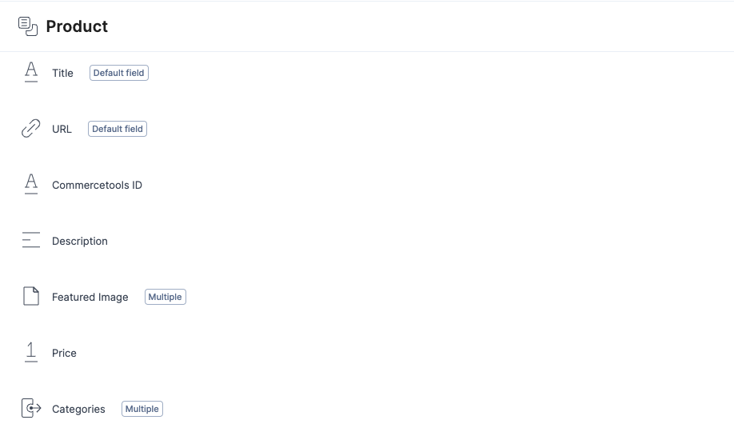
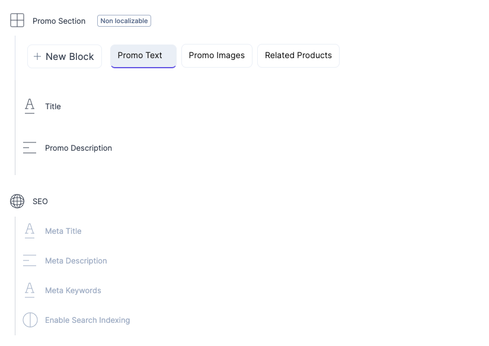
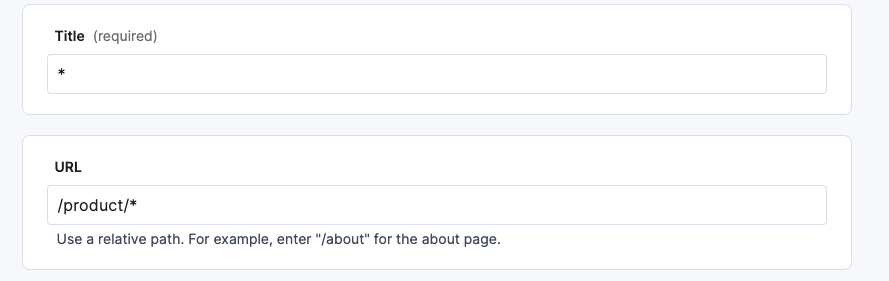

# Step 2. Practical Task - Integrate Contentstack with your frontend

Here's an example of applications you can explore: [Sample Apps](https://www.contentstack.com/docs/developers/sample-apps).

To get hands-on experience, follow these steps:

1. **Create a Product Content Type and Entry:**
   - Define a Product Layout in your Contentstack dashboard.
    
   - Create several entries based on the created content type using 'URL' or 'Commercetools Id' to match Commercetools data and Contentstack entry
   

2. **Incorporate in Your App:**
   - Integrate entries you've created into your application.
3. **Query Example:**
   - Use the following query example to retrieve Product entries: `https://{{base_url}}/v3/content_types/product/entries?environment={{environment}}&query={"commercetools_id": "12345"}`
   - Replace `{{base_url}}` with the actual base URL and `{{environment}}` with the relevant environment and `{{content_type_uid}}`
