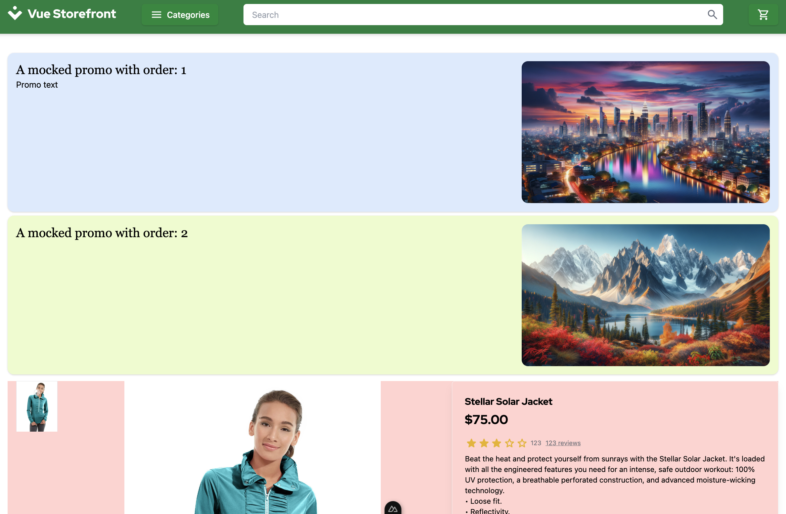

# 4.4. Practical Task - Integrate Contentstack with your frontend

## What is this task about

The essence of this task is to create server-side logic that retrieves the content model from Contentstack and serves the storefront, implementing the necessary contracts.


## What should be done

You need to configure ContentStack content and implement logic that will pull data from ContentStack and provide it to StoreFront.

- Contentstack Setup: Creation of content types and entities in Contentstack to represent products.
- Server-side Logic: Implementation of logic to fetch entities based on products from Contentstack.
- Integration with Storefront UI: Integration of server-side logic with the storefront UI to ensure smooth data presentation.
- Validation of Frontend Updates: Verification that changes made to orders or content in Contentstack reflect accurately on the storefront UI.


## Integration with the Storefront

The Storefront set up to display a list of promos on the Product Details Page. You can open page [http://localhost:3000/products/WJ01-S-Blue](http://localhost:3000/products/WJ01-S-Blue) to see how list of Promos looks. It should be similar to the picture below:



:::important
The mocked promos are displayed only for Product with SKU "WJ01-S-Blue" 
:::

To load the promos the Storefront sends following request:
```
GET /promos/:sku
```
Where `:sku` is the Product's SKU

The answer should implement the interface below:
```typescript
export type Layout = {
    sku: string;
    promos: {
      text: string;
      order: number;
    }[];
  };
```

The `text` should contain rendeded `html`. Whatever comes there will be displayed in the promos section

Example of response:
```
{
   sku: "WJ01-S-Blue",
   promos: [{
         order: 2,
         text: `
            <div class="p-4 my-2 flex h-[300px] shadow bg-lime-100 rounded-xl">
               <div class="flex-grow">
                     <h2 class="text-2xl font-serif">A mocked promo with order: 2</h2>
               </div>
               <div>
                     
               </div>
            </div>
         `
   }]
}
```


## Task 

1. Create a Product Content Type and Entry:
   - Define a Product Layout in your Contentstack dashboard.
    
   - Create several entries based on the created content type using 'URL' or 'Commercetools Id' to match Commercetools data and Contentstack entry
   

2. Incorporate in Your App:

   Integrate entries you've created into your application. 


3. Rearrange Components

   Within the selected Entry, adjust the order of components as needed. For example, you can rearrange the content of the Promo section.

4. Check the Changes

   Once you're satisfied with the adjustments, hit the publish button. Make sure that the changes are reflected on your website.

