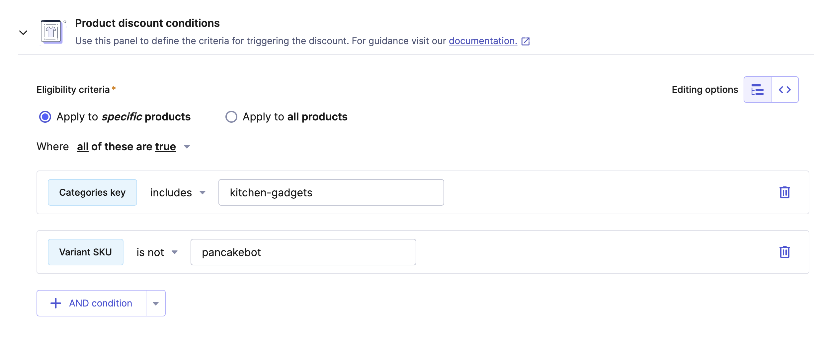
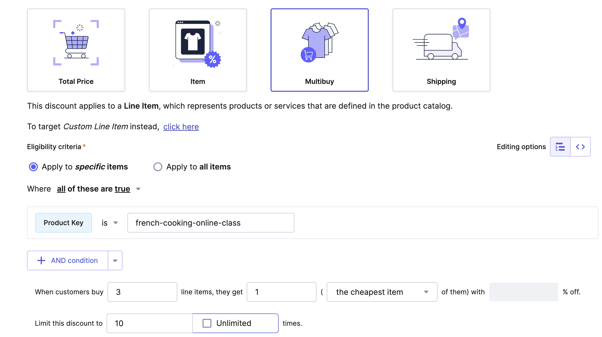

# 6.1. Introduction

## What's this module about?

## What you will do?

## Promotions

Promotions aren't just for advertising online stores; they're a key part of how they work.
They help stores get noticed, bring in new customers, boost sales, and keep people coming back.
Plus, they give stores important information and help them stay ahead of the competition.
Understanding and using promotions effectively is really important for online stores to keep doing well over time.
There are lots of different kinds of promotions, and each business usually has its own special ones.
But we can still put promotions into a few main groups:

<table>
    <thead>
    <tr>
        <th>Group</th>
        <th>Examples</th>
    </tr>
    </thead>
    <tbody>
    <tr>
        <td>
Cart Promotions
</td>
        <td>
            <ul>
                <li>Buy one get one free</li>
                <li>Free shipping</li>
            </ul>
        </td>
    </tr>
    <tr>
        <td>
Coupons
</td>
        <td>
            <ul>
                <li>Coupons or fixed-amount discounts</li>
            </ul>
        </td>
    </tr>
    <tr>
        <td>
Product discounts
</td>
        <td>
            <ul>
                <li>Percentage off</li>
                <li>Bundle or bulk discounts</li>
            </ul>
        </td>
    </tr>
    </tbody>
</table>

Sometimes, Loyalty Rewards are also considered part of promotions, but they're actually quite different and have their own complexities.

### Promotions/Discounts in Commercetools

#### Product discounts
Product discounts typically apply to a group of products and are shown on the product details page.

In commercetools, only one discount can be applied to a product, and there's a limit of 500 discount types.

For instance, during a Summer Sale, certain stores might offer significant discounts on winter clothes.

*Example of Product Discount in Commercetools:*

#### Cart discounts

Cart discounts in commercetools depend on various conditions related to the items in the shopping cart. They can be configured to exclude specific items from the discount and are applicable to different targets such as line items, shipping, or multi-buy scenarios. Some cart discounts may require customers to input a discount code during checkout to activate the discount.

These discounts can be of different types, including absolute discounts, relative discounts, gift line item discounts, or fixed price discounts. There's a limit of 100 cart discounts, but there's no limit for discounts that are associated with specific codes.

Examples of cart discounts include "Buy 2 Get 1 Free," "Buy 30 Euro to get 10% off," or "Buy 2 for 50."

*Example of Cart Discount in Commercetools:*

#### Discount codes

Discount codes in commercetools are characterized by several features. They consist of a character string with a maximum length of 64 characters and are case-sensitive. These codes can be configured to set a maximum number of applications, and they can be marked as active or inactive.

Discount codes are often associated with vouchers, such as "SALE2021," or can serve as a means to control cart discounts, like "23ng-73ffd-736d."

## Prerequisites

- Completed **[Module 3 - Integration with e-Commerce Engine Commercetools](/docs/3-integration-with-ecom/01-introduction.mdx)**