import { Highlight } from '/src/components/Shared';

# 6.3 Practical Task - Promotions

## What is this task about
This task involves configuring various promotion conditions in Commercetools to enhance the shopping experience for customers.
Additionally the task involves modifying the Backend For Frontend (BFF) logic to enable promotions functionality on the Storefront.


## What should be done
* Commercetools: You will create various promotions for several real-world scenarios.
* BFF: Implement possibility to apply promotions and extend Cart response to include discount information.


## Task

1. Create following promotions in Commercetools:

    1.1. **Percentage Discount on Cart Items.**
    As a customer, I want to receive a 10% discount on my entire cart when I apply the code "SAVE10", so that I can save money on my purchase.
    <details>
        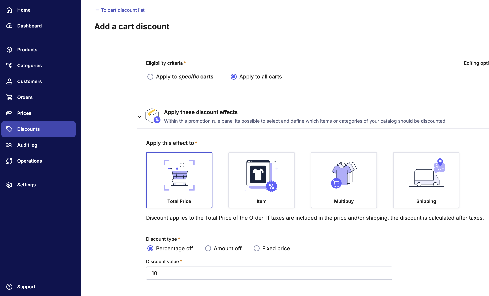
        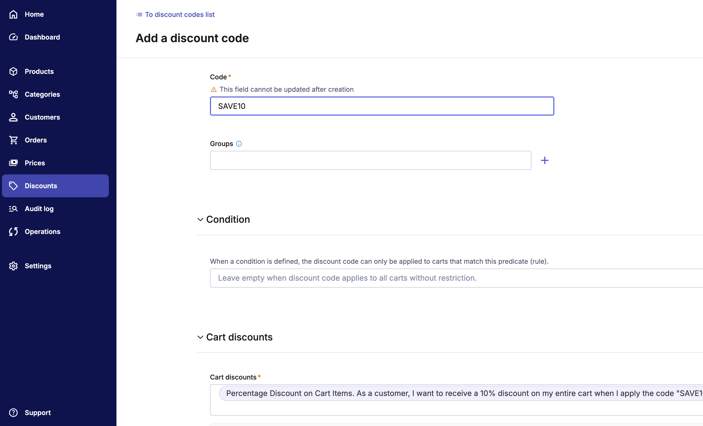
    </details>

    1.2. **Fixed Amount Discount on Specific Products.**
    As a store administrator, I want to create a promotion where customers get a $20 discount on a specific product when they buy two or more units, so that I can boost sales for that particular product.
    <details>
        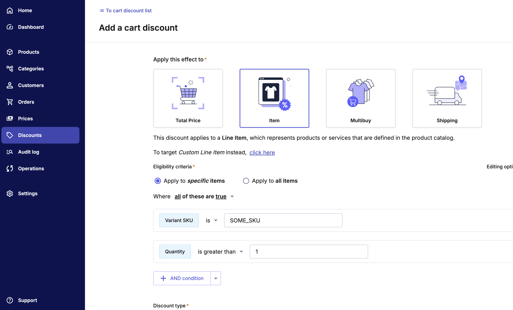
        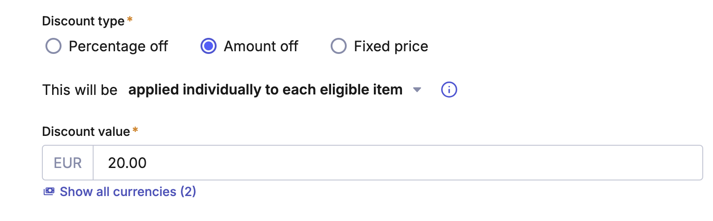
    </details>


    1.3. **Buy One, Get One (BOGO) Free.**
    As a customer, I want to be eligible for a "Buy One, Get One Free" promotion on selected items in my cart, so that I can get additional products at no extra cost.
    <details>
        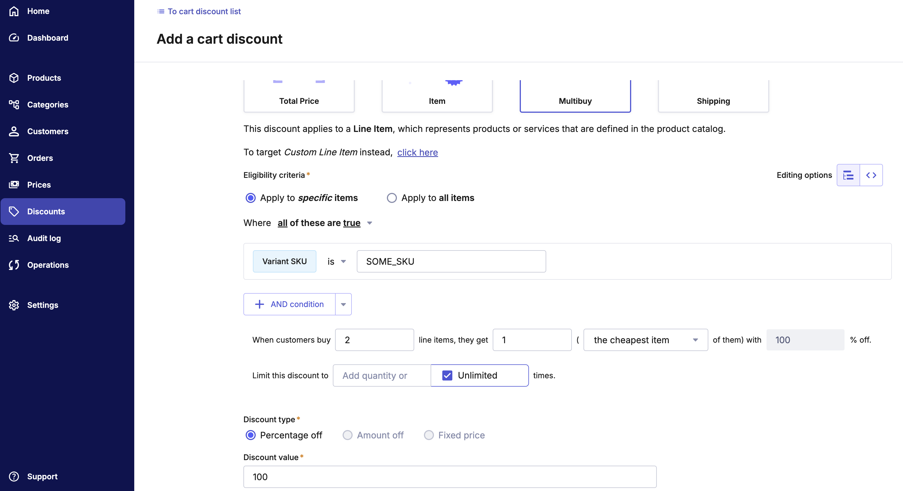
    </details>

    1.4. **Tiered Discount on Order Total.**
    As a customer, I want to receive a 5% discount on my order total when it reaches $100, and a 10% discount when it reaches $200, so that I can save money on larger purchases.
    <details>
        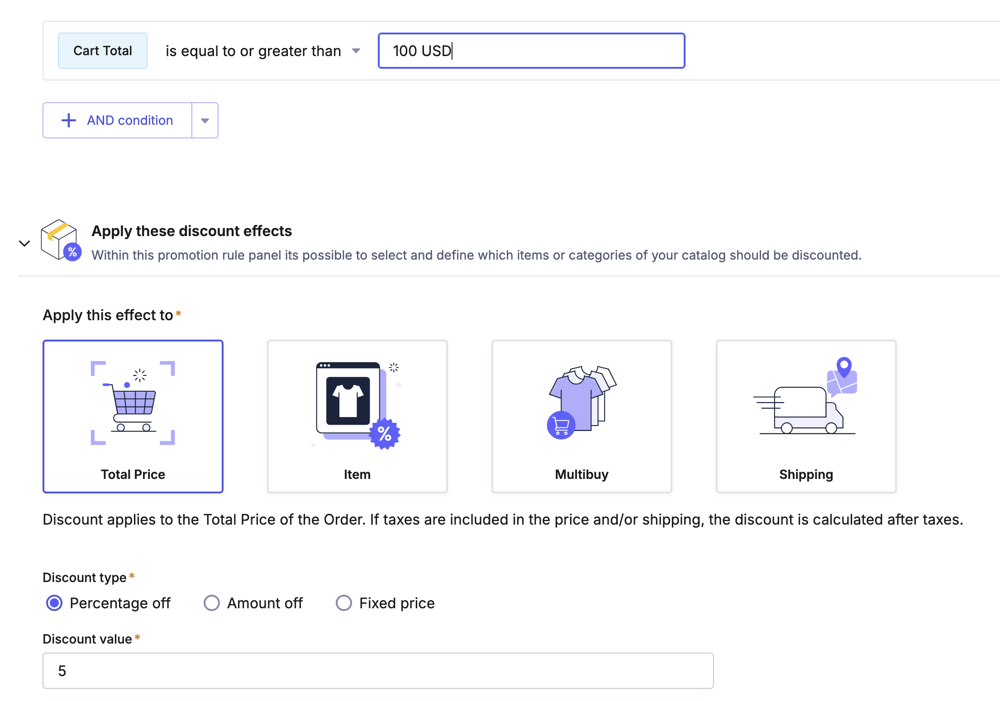
        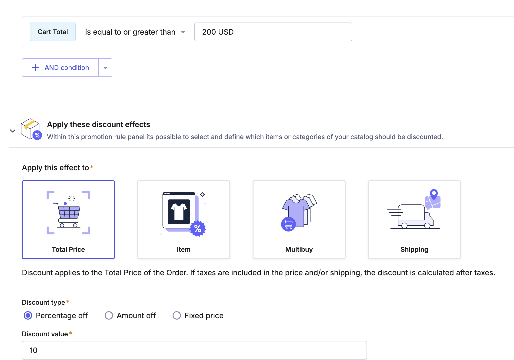
    </details>

    1.5. **Exclusive Customer Group Discount.**
    As a store administrator, I want to create a special discount for VIP customers, providing them with a 15% discount on all products, so that I can reward and retain loyal customers.
    <details>
        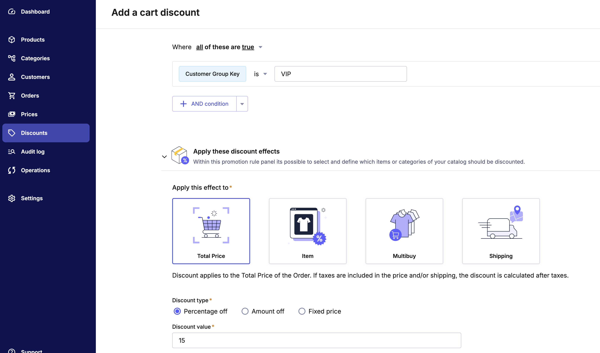
    </details>

    1.6. **Free Shipping Threshold.**
    As a customer, I want to qualify for free shipping when my order total reaches $50, so that I can avoid additional shipping costs.
    <details>
        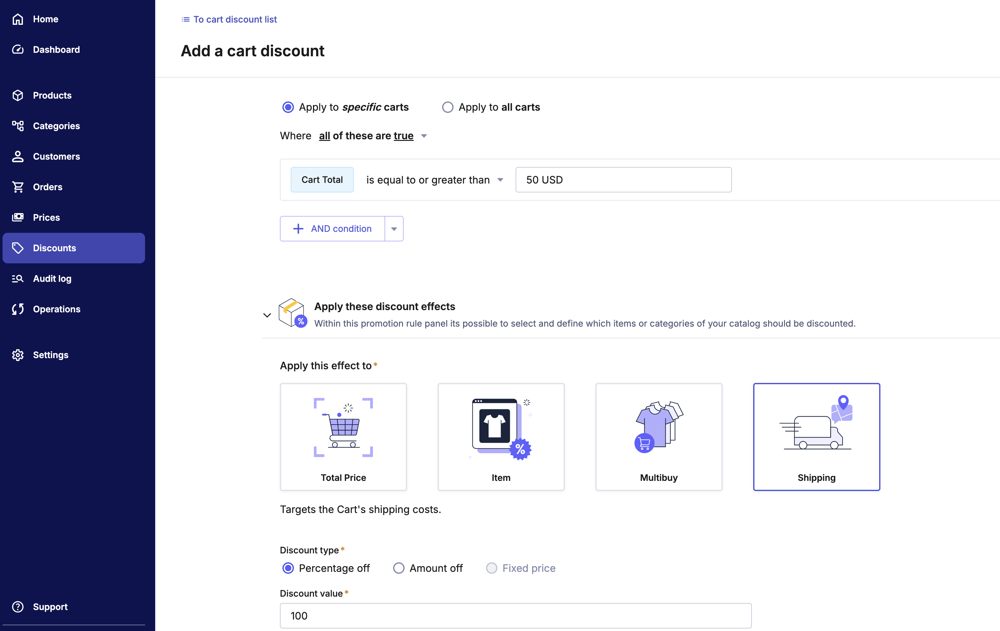
    </details>


    1.7. **Product Bundle Discount.**
    As a customer, I want to receive a discount when I buy a predefined bundle of products, so that I can save money on purchasing them together.
    <details>
        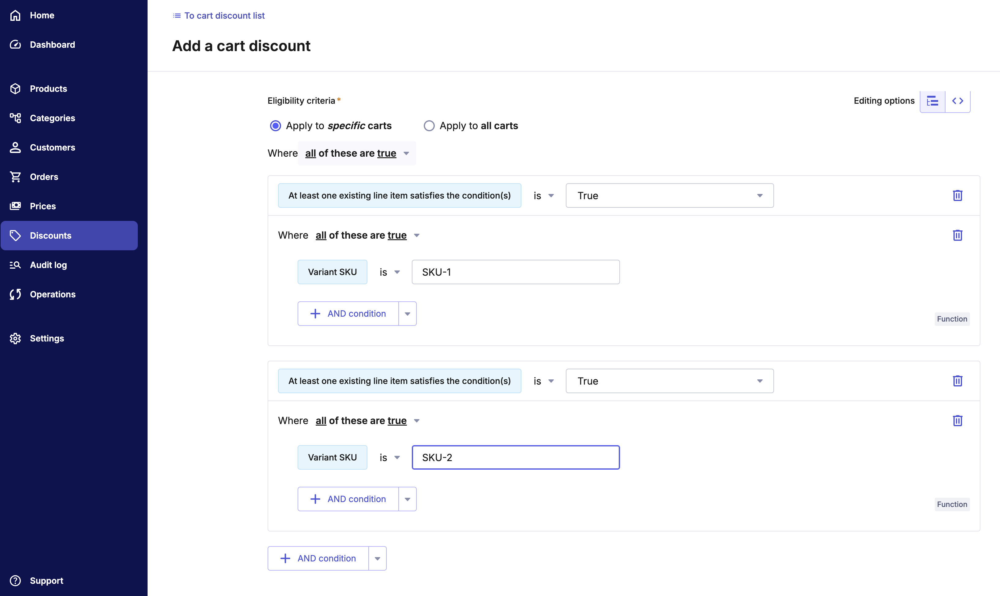
        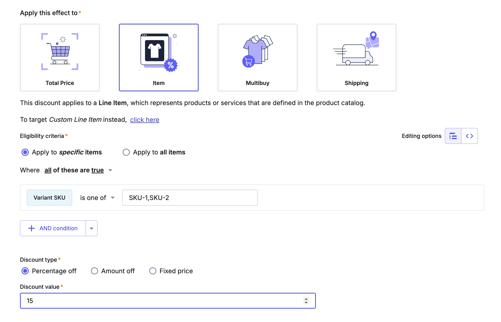
    </details>


2. Extend BFF Cart response to support product discount. Response must contain discounted price. This discounted price will allow user to see both basic price and discounted price on UI. Please refer to request **Get Cart** in the [StoreFront Postman Collection](https://github.com/EPAM-JS-Competency-center/camp-storefront-nuxt/tree/main/postman) to find example of the request and response.

3. Extend BFF Cart update API to support functionality that allows to apply promotions. Please refer to request **Put Cart / AddDiscountCode** in the [StoreFront Postman Collection](https://github.com/EPAM-JS-Competency-center/camp-storefront-nuxt/tree/main/postman) to find example of the request and response.

## Commercetools API

### Cart
#### Get Cart by id
##### <Highlight color="#108a8c">GET</Highlight> `{{host}}/{{project-key}}/carts/{{cart-id}}`

#### Add discount code
##### <Highlight color="#109049">POST</Highlight> `{{host}}/{{project-key}}/carts/{{cart-id}}`
```jsx title="Request Body"
{
   "version": {{cart-version}},
   "actions": [
      {
         "action" : "addDiscountCode",
         "code" : "mydiscountcode",
      }
   ]
}
```