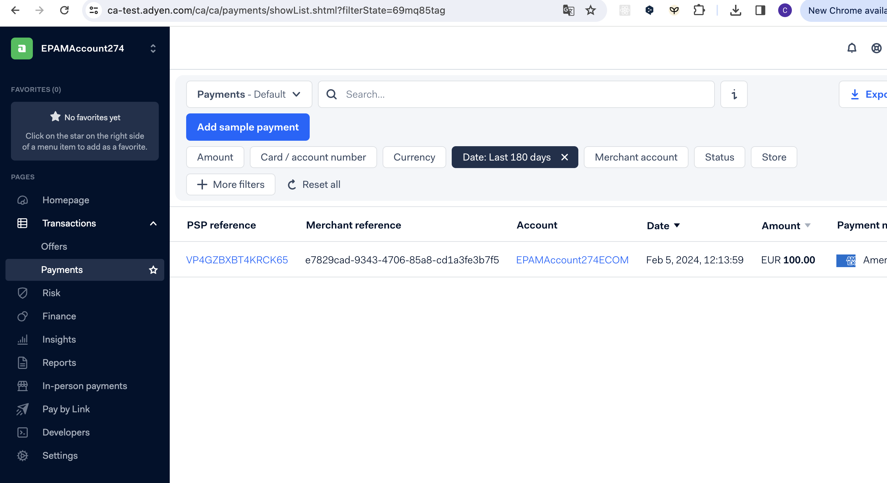

# 7.3. Practical Task - PSP Account initial setup

## What is this task about

The task involves configuring Payment Service Provider (Adyen or Stripe in our case) and preparing it to work with the application by defining needed settings.

## What should be done

1. **Register test account**
   - https://www.adyen.com/signup

     Please note: it requires Phone number and business email.

     ** Hint: it require phone number. In my case there was no any SMS or code-validation. You can try to use any fake number.


     Expect: when you navigate to https://ca-test.adyen.com/ you could log in with your credentials and see this Dashboard.

     

2. **Lunch any workable project to see how it works under the hood**  
    To run a simple Adyen payment project we need a project.
    I used this one (for React): https://github.com/adyen-examples/adyen-react-online-payments

    but there are also other projects:

   a) rich repo with many integration examples: https://github.com/adyen-examples/adyen-node-online-payments/tree/main/checkout-example


```
ENV Variables that you will need:

# server-side env variables
ADYEN_API_KEY=""
ADYEN_MERCHANT_ACCOUNT=""
 
 
# client-side env variables: using REACT_APP prefix to be included in the REACT build
REACT_APP_ADYEN_CLIENT_KEY=test_XLWIUFSLWJDJ7DEWS4YP54M6ZEL7B42Z
```

here link how to generate variables:

https://docs.adyen.com/development-resources/api-credentials/#generate-api-key


Expected results after this step: 

a) with correct API Keys and ClientKey project should started

b) the UI (of forked/cloned project) will guide you: how to process payments with Credit Card or using another payment method.

c) the code base (of forked/cloned project) will guide you with the code how it works

3. **How to run it in your client?**
Here is just my experience. I guess with different environment and after decades ((wink)) - the steps could be changed. But the idea is the following:

a) Need to reed official Doc about basic endpoints. (At here are 100+ pages, please read only this first basic page)

https://docs.adyen.com/api-explorer/Checkout/71/overview


```
Each request to Checkout API must be signed with an API key. For this, 

get your API key from your Customer Area, and set this key to the X-API-Key header value, for example:

curl -H "Content-Type: application/json" \ -H "X-API-Key: YOUR_API_KEY" \
DO NOT passing this header will lead to 401 Unauthorises error.
```


b) Instal official npm package

I used this one: https://www.npmjs.com/package/@adyen/adyen-web

DO NOT FORGET to import component with CSS
```
import AdyenCheckout from '@adyen/adyen-web';
import '@adyen/adyen-web/dist/adyen.css';
```

c) Every client need a Session. session object we will use to past to Adyen Component

session api link: https://docs.adyen.com/api-explorer/Checkout/71/post/applePay/sessions

Hint: I guess, it is better to fetch session in parent component and pass to children. More over session could be stored at Redux (other your storage)

as there is no need to fetch session again and again on every re-render.

```
export const createSession = async () => {
  return await fetch("https://checkout-test.adyen.com/v71/sessions", {
    method: "POST",
    headers: new Headers({
      "Content-Type": "application/json",
      "X-API-Key": "your-api-key",
    }),
    body: JSON.stringify({
      merchantAccount: "MY ACCOUNT STARTED WITH THIS PREFIX: EPAMAccountxxxCOM",
      amount: {  //configure it buy your business needs
        value: 100,
        currency: "EUR",
      },
      returnUrl: "http://localhost:3000/checkout?shopperOrder=12xy..", //configure it buy your business needs
      reference: "be5b976d-ea5d-4801-9232-0f9a8fb50c0f",   //generated rundom number / or number from CMS aka E-Commerce
      countryCode: "DE",   //configure it buy your business needs
    }),
  }).then((response) => response.json())
```

d) The Session was received specially for Drop-in component

here is a guide: https://docs.adyen.com/online-payments/build-your-integration/?platform=Web&integration=Drop-in&version=5.55.1

and here is npm package that we installed: https://www.npmjs.com/package/@adyen/adyen-web


What is the logic:

Created empty div with specific ID
Running Adyen function will return "a Drop-in component"
