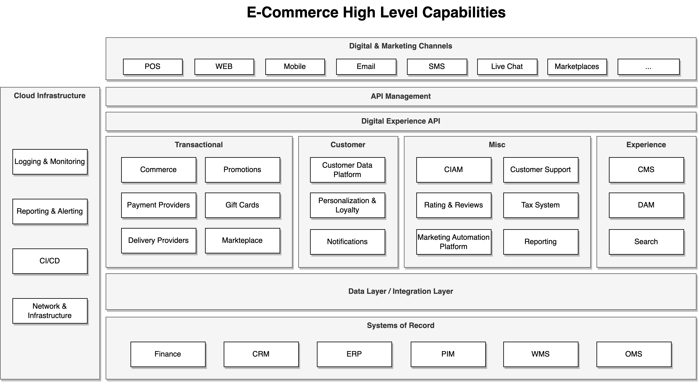
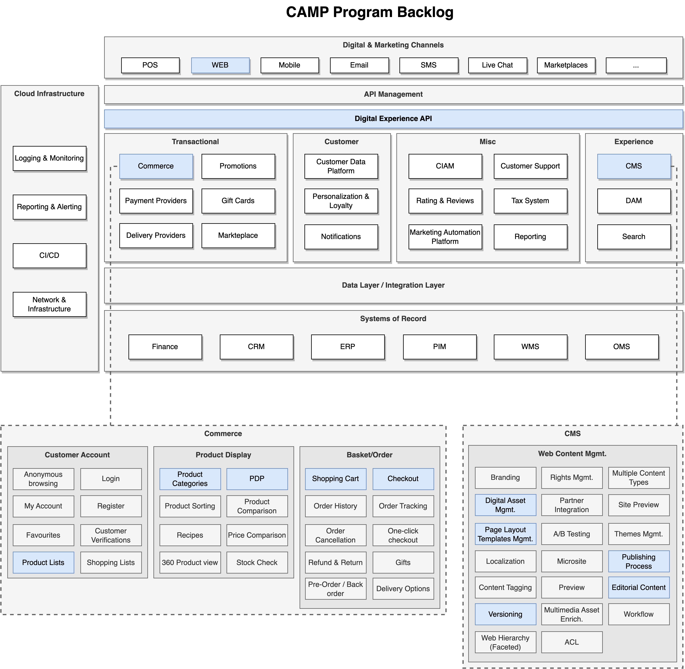

# Composable Architecture Mastery Platform (CAMP)

:::warning
- TODO: add part about phase 2, and how it relate to current phase - Dmitry
- TODO2: add part about goal/context of Graduate Work - Alexander
- TODO3: rewrite part scope of program or add details if actual - Alexander
:::

Welcome to **Composable Architecture Mastery Platform (CAMP)**!

## Program Description
The industry is changing fast, making personal development growth much more complicated than in previous years. But following our expertise and external analytics and market research agencies like Gartner and Forrester, the retail domain and composable architecture will be one of the enablers for AI expansion.

That is why we designed and developed the program to offer hands-on experience in creating and implementing an e-commerce composable architecture. The program follows a structured, unique step-by-step format to guide you through the essential components of building an e-commerce solution, including diving into the e-commerce domain specifics and developing a production-like solution based on the main commerce flow:
- Product Listing Page (PLP)
- Product Detail Page (PDP)
- Shopping Cart
- Checkout

As part of the curriculum, participants will be introduced to relevant licensing agreements and provided comprehensive guides for deploying these systems on local machines. The program is based on the MACH-stack platforms, ensuring the development of flexible, scalable, and future-proof e-commerce architectures.

The ultimate objective of this program is to serve as a self-paced learning tool aimed at systematically upskilling individuals to become proficient in this tech stack. By combining theoretical knowledge with practical exercises, the course fosters the development of both a fundamental and an advanced understanding of composable e-commerce systems, thus facilitating a smooth transition into this rapidly growing field.

## Program Principles

The program follows the following principles:
- Hands-on exercises: Encourage practical learning through real-world scenarios and tasks.
- Regular assessments: Track learning progress and identify areas that require additional focus.
- Support and community: Establish a supportive network for learners to share knowledge and experiences.
- Regular updates: Ensure the course content reflects the latest trends and developments in composable e-commerce.
- Certification: Provide a course completion certificate, which could boost learners' professional profiles (support actual certification, e.g. Contentstack).
Accessibility: Make the course available in multiple formats to suit different learning styles and schedules.
- Industry insights: Involve industry experts to share insights and practical tips.
- Accumulation engineering practices

## Program Goal

The tactical purpose of the program is to get hands-on experience with the domain and such product development:
- Step-by-step dive into industry knowledge, which is crucial for a new engineering mindset.
- Touch in detail with composite architecture and MACH capabilities and principles.
- Develop an efficient Backend for Frontend (BFF) layer.
- Apply best practices specific to the e-commerce domain.
- Integrate the e-commerce engine using Commercetools platform.
- Incorporate Content Management Systems (CMS) using Contentstack platform.
- Execute a step-by-step transformation and migration process for transitioning from monolithic to composable architecture.

The strategic purpose is to unlock the following benefits:
- Unlock the next phase of the program to dive even deeper into the commerce world through the enhancement of the existing e-commerce engine, integration with other critical services on the retail such as Order Management (OMS), Payments (PSP), Product Management (PIM), Inventory Management, and Search.
- Cover more real business cases and places for AI usage opportunities.
- Become a part of a fast-growing practice and community in EPAM and boost your professional growth.

## Architecture Concept

## Scope of Program

## Additional Program info

https://kb.epam.com/pages/viewpage.action?pageId=2018877836
