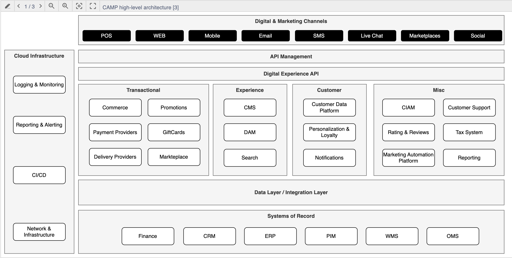

# Composable Architecture Mastery Platform (CAMP)

Welcome to **Composable Architecture Mastery Platform (CAMP)**!

Program Description
This program focuses on the design and implementation of a composable e-commerce architecture utilizing a predefined stack and a variety of product options. As part of the curriculum, participants will be introduced to relevant licensing agreements and provided with comprehensive guides for deploying these systems on local machines.

Our unique, step-by-step training modules will foster practical skills and a deep understanding of the e-commerce domain. Each module is designed as a learning trail, guiding participants through the entire process: from the initial setup of the architecture to the establishment of backend-for-frontend (BFF) structures, service creation, and key e-commerce components such as Product Detail Pages (PDP), Product Listing Pages (PLP), and checkout procedures.

The ultimate objective of this program is to serve as a self-paced learning tool aimed at systematically upskilling individuals to become proficient in this tech stack. By combining theoretical knowledge with practical exercises, the course fosters the development of both a fundamental and an advanced understanding of composable e-commerce systems, thus facilitating a smooth transition into this rapidly growing field.

## Program Principles

The program follows the following principles:
- Hands-on exercises: Encourage practical learning through real-world scenarios and tasks.
- Regular assessments: Track learning progress and identify areas that require additional focus.
- Support and community: Establish a supportive network for learners to share knowledge and experiences.
- Regular updates: Ensure the course content reflects the latest trends and developments in composable e-commerce.
- Certification: Provide a course completion certificate, which could boost learners' professional profiles. (support real certification, e.g. Contentstack)
Accessibility: Make the course available in multiple formats to suit different learning styles and schedules.
- Industry insights: Involve industry experts to share insights and practical tips.
- Accumulation engineering practices

## Architecture Concept

## Scope of Program

## Additional Program info

https://kb.epam.com/pages/viewpage.action?pageId=2018877836